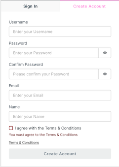

# Create an Account
{: .no_toc }

1. To create an account, go to <a href="https://app.qr-contest.com" target="_blank">https://app.qr-contest.com</a> and select Create Account in the top tab.

   

   
   

2. Enter a Usename, Password, Email and your Name.  You are required to accept the <a href="https://qr-contest.com/tandc.html" target="_blank">Terms & Conditions</a> to use QR-Contest.

3. To verify your account, you will receive an email from **no-reply@verficationemail.com** - which is an Amazon service - that contains your verification code, e.g.:

   

   
   

4. Enter you verification code on the next screen that will appear after you click Create Account and press Confirm

   

   
   

5. Your account is now created.  To manage your account, go to the Home tab and choose the <i class="fa-solid fa-bars"></i> menu in the upper right, then [Edit Profile](../screens/edit_profile).
