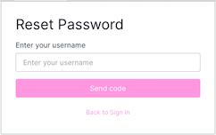

# Sign In
{: .no_toc }

1. To Sign In, fill out your username and password.  If you forgot your password, click the *Forgot your password?* link to reset it.

   

# Forgot Password
{: .no_toc }

1. To reset your password, enter your username and press Send Code, you will receive a code via email from **no-reply@verificationemail.com**

    

2. Enter your code from the email and enter a new password.

    