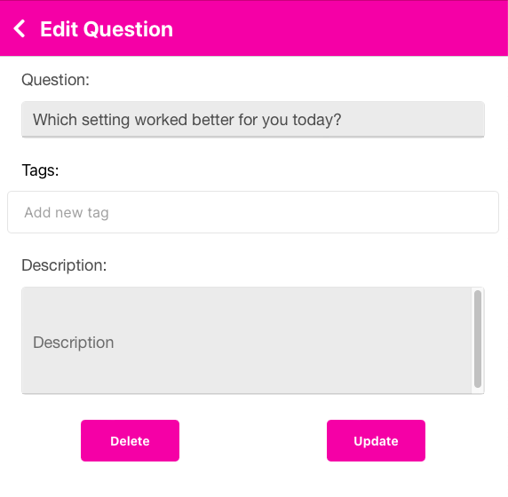
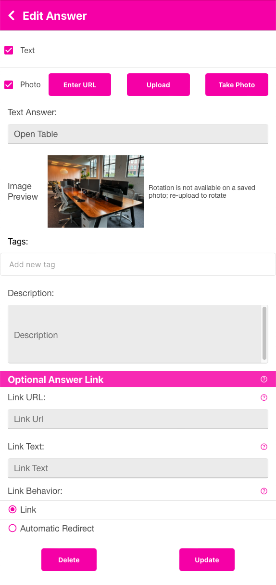

{: .no_toc}

  

    Table of contents
  

  {: .text-delta }
- Table of Contents
{: toc}

Questions and Answers

## Questions and Answers
  Selecting this section will display the list of Questions that you have created.  When you go to the Contest Detail screen, the first accordion (section) to open up is this one.  To add a new Question, you click on the plus sign <i class="fa-solid fa-square-plus"></i> Add Question.  An empty text box will appear where you enter the Question. You may add multiple Questions per contest *prior* to paying for and launching your contest. See the NOTE below.

   

{: .note }
> If the plus sign Add Question does not appear, it is because you have already purchased this Contest and Question.  If this is the case, a small help icon will appear to the right of the paid for question reminding you that you cannot add or change this quesiton.  You may not add new Questions to an already launched contest.  However, it is possible to add new Answers to an already paid for Question.  Click the question and you will see the paid for answers with a lock next to them, but the plus sign <i class="fa-solid fa-square-plus"></i> Add Answer will be available.  You may add the new Answers and then go to the Pay and Launch accordion to pay for them. To add a new Question, create a new contest and add the question there.

### Questions
When you click the plus sign <i class="fa-solid fa-square-plus"></i> Add Question, a text box should appear for you to start typing into.  

   

If it does not, you may also edit the Question text by pressing the Edit <i class="fa-solid fa-pen-to-square"></i> icon to the left of the text.  You will get the Edit Question form shown below.

   

If you do not want to edit anything, you may press the back chevron <i class="fa-solid fa-chevron-left"></i> in the upper left.  You may delete this question by presing the Delete button.  If you make any changes, be sure to press the Update button.

You may add Tags that may be used in any Contest.  You add a tag by typing the tag value, in the case below, 'chicken' was typed.  That will add the tag to your global tags.  If you have other tags, they will auto-complete as you start to type them. So, if you add 'chicken' here and later in an Answer you type 'ch' - it should auto-complete to 'chicken'.   The tags are to assist you in organizing your information.  They will show up in the user interface on a later update to the application.

   

### Answers
To add answers, you need to click on the Question (you'll see a up/down chevron on the right of the question).

When you click the plus sign <i class="fa-solid fa-square-plus"></i> Add Answer, a text box should appear for you to start typing into (just like Questions).  Below you'll see we added 3 Answers.

   

{: .note }
> Any time you have text in a list, you may long-press on it to edit the text inline.  This saves you steps from pressing the pencil and editing the text in a form.

#### Reorder Answers
The up/down arrows icon on the left of each Answer allows you to reorder the Answers.  Long press on the up/down arrows and then drag the Answer to the position you would like.  The Answers will show up in your PDF or PNG files in the order you have them here.

#### Edit Answer
You may edit the Answer details by pressing the pen <i class="fa-solid fa-pen"></i> icon to the left of the text.  You will get the Edit Answer form shown below.

   

