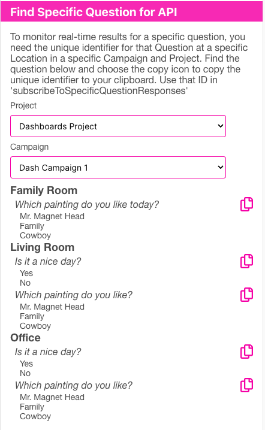

<div class="sticky-gotop">
<span class="inline-icon"><i class="fa-solid fa-arrow-up"></i></span>
</div>

# API
{: .no_toc }

<div class="sticky-gotop">
<span class="inline-icon"><i class="fa-solid fa-arrow-up"></i></span>
</div>
<div class="sticky-right">
<details markdown="block">
  <summary>
    Quick Links
  </summary>
  {: .text-delta }
- Quick Links
{: toc}
</details>
</div>

## npm install qranswers

To install the javascript package as part of your application, use:

```npm install qranswers```

## qranswers Module Usage

You will need your API key from the Developer accordion of [Manage Plan](../menu/home_menu.html#developer)

To initialize the qranswers module, you will need to have your API Key and load the module like this:

```
const apiKey = "api_e1238.....";
const qranswers = require("qranswers")(apiKey)
```


## The Subscription Response Object
<span class="obj-attributes-title">Attributes</span>
<div class="obj-attribs">
    <div class="obj-pname">baseId<span class="obj-ptype">147 characters</span></div>
    <div class="obj-descr">The id is a 147 characer attribute that uniquely defines this specific Question.  A baseId is the campaignId_questionLocationid_locationId_questionId that uniquely defines this Response.</div>
</div>
<div class="obj-attribs">
    <div class="obj-pname">clientId<span class="obj-ptype">36 characters</span></div>
    <div class="obj-descr">The unique identifier for the Client</div>
</div>
<div class="obj-attribs">
    <div class="obj-pname">projectId<span class="obj-ptype">36 characters</span></div>
    <div class="obj-descr">The unique identifier for the Project</div>
</div>
<div class="obj-attribs">
    <div class="obj-pname">answerId<span class="obj-ptype">36 characters</span></div>
    <div class="obj-descr">The unique identifier for the Answer</div>
</div>
<div class="obj-attribs">
    <div class="obj-pname">count<span class="obj-ptype">integer</span></div>
    <div class="obj-descr">The sum of the number of responses for this specific answer.  So, if 99 votes were received prior to this vote, then the count for this Answer's vote would be 100</div>
</div>

### Subscriptions
You may subscribe to real-time Responses in your application by initializing the subscription module and subscribing to the Responses you are looking for.  A Response is generated when someone scans the QR code for your answer.  The Response consists of the information as to what Project, Campaign, Location, Question and Answer was chosen - this is the [Subscription Response Object](#the-subscription-response-object) described above..  Remember that an answer is scoped to a particular Campaign, Location and Question. Since the Question can be posted in more than one location, the unique identifier (we call it the baseId) is formed by this pattern:  &lt;campaignId&gt;_&lt;questionLoationId&gt;_&lt;locationId&gt;_&lt;questionId&gt;.  You may subscribe to Responses for all of your Campaigns, or you may subscribe to a single Question at a particular Location in a particular Campaign.  If you are using React (our recommendation), the pattern to follow is to subsribe and cleanup as follows (this code subscribes to all Responses):

```
const [qrInited, setQrInited] = useState(false);
...
useEffect(() => {
    if (qrInited) {
        const sub = qranswers.subscriptions.subscribeToAllResponses((response) => {
            console.lg('response', response);
        })
        return () => {
            // Subscriptions need to be cleaned up when the component unmounts
            qranswers.subscriptions.unsubscribeToAllResponses(sub);
        }
    }
}, [qrInited])

useEffect(() => {
    async function initQR()  {
        const initOk = await qranswers.subscriptions.initialize();
        setQrInited(initOk);
    }
    initQR();
}, [])
```

To subscribe to an individual Question's answers/Responses, follow this pattern (the baseId can be determined by going to the Developer section of the app and selecting <span class="form-label">Find Specific Question for API</span>, the clicking the 'copy' icon to get the baseId.  use the baseId below):

  <p align="center" class="screen-shot">
  
  </p>


```
const baseId = "6dbbffc8-4742xxxx_54a2d82xxxx_f366dexxxx_f76c45axxxx";

const [qrInited, setQrInited] = useState(false);
...
useEffect(() => {
    if (qrInited) {
        const sub = qranswers.subscriptions.subscribeToSpecificQuestionResponses(baseId, (response) => {
            console.lg('response', response);
        })
        return () => {
            // Subscriptions need to be cleaned up when the component unmounts
            qranswers.subscriptions.unsubscribeToSpecificQuestionResponses(sub);
        }
    }
}, [qrInited])

useEffect(() => {
    async function initQR()  {
        const initOk = await qranswers.subscriptions.initialize();
        setQrInited(initOk);
    }
    initQR();
}, [])
```


## API 

The API wrapper in the qranswers module makes calls to the REST APIs of qr-answers.com.  The base URL for all REST APIs is ```https://api.qr-answers.com/v1```.  For example, to get the list of Locations for a given Project ID ("56abd812_xxx"), the wrapper fetches ```https://api.qr-answers.com/v1/locations/list/56abd812_xxx``` with ```Authorization``` header of the API Key.  For example:

{: .note }
> IDs are 36 characters, for example: "6dbbffc8-4742-4bb5-9732-405c18965da1".  Rather than using real IDs, in our examples, we shorten the IDs to have _xxxx instead of all 36 characters.


```javascript
const url = "https://api.qr-answers.com/v1/locations/list/56abd812_xxx";
try {
    const result = await fetch(url, {
        headers: {
            Accept: '*/*',
            Authorization: this.apiKey
        }
    })
    const json = await result.json();
    return json;
} catch (err) {
    console.error(err);
}
```


Below are sample routines using the wrapper functions in the qranswers module.  These examples use React and a standard pattern of setting a 'fetching' variable to show a progress spinner, then retrieving the data, turning off the fetching progress spinner and returning the data via a setXXXX() useState() variable.  Here is the rendering pattern:

```jsx
const [fetchingProjects, setFetchingProject] = useState(false);
const [projects, setProjects] = useState(null);

...

{fetchingProjects && 
    <ActivityIndictor size="large" color="#0000ff" />
}
{!fetchingProjects && projects && projects.map((thisProject) => {
    return (
        <Text>{thisProject.name}</Text>
    )
})}

...
```

## The Project Object
<span class="obj-attributes-title">Attributes</span>
<div class="obj-attribs">
    <div class="obj-pname">id<span class="obj-ptype">36 characters</span></div>
    <div class="obj-descr">The id is a 36 characer attribute that uniquely defines this Project</div>
</div>
<div class="obj-attribs">
    <div class="obj-pname">name<span class="obj-ptype">string</span></div>
    <div class="obj-descr">The name is a string used to identify this Project</div>
</div>
<div class="obj-attribs">
    <div class="obj-pname">abbreviation<span class="obj-ptype">string</span></div>
    <div class="obj-descr">The abbreviation is a short version of the name that is displayed during some presentations of results for this Project</div>
</div>
<div class="obj-attribs">
    <div class="obj-pname">tags<span class="obj-ptype">vertical bar delimited string</span></div>
    <div class="obj-descr">The tags is a string of vertgical bar limited tags. For ecample, "dog|pet|animal"</div>
</div>
<div class="obj-attribs">
    <div class="obj-pname">description<span class="obj-ptype">string</span></div>
    <div class="obj-descr">The description is a string typed in to help identify the Project</div>
</div>
<div class="obj-attribs">
    <div class="obj-pname">clientID<span class="obj-ptype">36 characters</span></div>
    <div class="obj-descr">The clientID is a unique identifier for this Project's client/owner.</div>
</div>
<div class="obj-attribs">
    <div class="obj-pname">recordStatus<span class="obj-ptype">string</span></div>
    <div class="obj-descr">The status of this record, could be one of 'active', 'archive', 'removed'</div>
</div>
<div class="obj-attribs">
    <div class="obj-pname">updatedAt<span class="obj-ptype">date time</span></div>
    <div class="obj-descr">The updatedAt values is a date/time string showing when the record was last updated. e.g. '2023-03-24T18:57:45.207Z'</div>
</div>

### Get Project
<span class="api-code">getProject(&lt;projectId&gt;)</span>
<span class="api-code-descr">Use getProject to retrieve a Project's Attributes </span>
```javascript
    const projectId = "56abd812_xxx";
    const projRet = await qranswers.api.getProject(projectId);

```
<span class="api-rest">REST API</span>
https://api.qr-answers.com/v1/projects/:projectId

### List Projects
<span class="api-code">getProjectList()</span>
<span class="api-code-descr">Use getProjectList to retrieve an array of all Project's</span>

```jsx
// Projects are retrieved based on your API Key.  If your API key is only valid for particular Projects, then
// you will only retrieve the Projects you have access to
  const fetchProjects = async () => {
    setFetchingProjects(true);
    const projRet = await qranswers.api.getProjectList();
    setFetchingProjects(false);
    // returns {success: 'success', data: [...]} or {error: 'error message'}
    if (projRet.data) {
      setProjects(projRet.data);
    } else {
      console.log(projRet);   
    }
```
<span class="api-rest">REST API</span>
https://api.qr-answers.com/v1/projects/list

## The Campaign Object
<span class="obj-attributes-title">Attributes</span>
<div class="obj-attribs">
    <div class="obj-pname">id<span class="obj-ptype">36 characters</span></div>
    <div class="obj-descr">The id is a 36 characer attribute that uniquely defines this Campaign</div>
</div>
<div class="obj-attribs">
    <div class="obj-pname">name<span class="obj-ptype">string</span></div>
    <div class="obj-descr">The name is a string used to identify this Campaign</div>
</div>
<div class="obj-attribs">
    <div class="obj-pname">abbreviation<span class="obj-ptype">string</span></div>
    <div class="obj-descr">The abbreviation is a short version of the name that is displayed during some presentations of results for this Campaign</div>
</div>
<div class="obj-attribs">
    <div class="obj-pname">tags<span class="obj-ptype">vertical bar delimited string</span></div>
    <div class="obj-descr">The tags is a string of vertgical bar limited tags. For ecample, "dog|pet|animal"</div>
</div>
<div class="obj-attribs">
    <div class="obj-pname">description<span class="obj-ptype">string</span></div>
    <div class="obj-descr">The description is a string typed in to help identify the Campaign</div>
</div>
<div class="obj-attribs">
    <div class="obj-pname">disposition<span class="obj-ptype">integer</span></div>
    <div class="obj-descr">0 = draft; 1 = active, 2 = inactive, 3 = archives</div>
</div>
<div class="obj-attribs">
    <div class="obj-pname">settings<span class="obj-ptype">object</span></div>
    <div class="obj-descr">The settings value is a JSON object with information on how the Campaign questions and answers are rendered to the output.  There are too many parameeres to list here (and they are read-only, so there is no need to describe them).</div>
</div>
<div class="obj-attribs">
    <div class="obj-pname">schedule<span class="obj-ptype">string</span></div>
    <div class="obj-descr">"onetime" = the voter may only vote one (1) time; "hourly" = the voter may registe their vote each hour; "daily" = the voter may register a vote once per day; "nolimit" = the voter may vote as many times as they like</div>
</div>
<div class="obj-attribs">
    <div class="obj-pname">clientID<span class="obj-ptype">36 characters</span></div>
    <div class="obj-descr">The clientID is a unique identifier for this Campaign's client/owner.</div>
</div>
<div class="obj-attribs">
    <div class="obj-pname">recordStatus<span class="obj-ptype">string</span></div>
    <div class="obj-descr">The status of this record, could be one of 'active', 'archive', 'removed'</div>
</div>
<div class="obj-attribs">
    <div class="obj-pname">updatedAt<span class="obj-ptype">date time</span></div>
    <div class="obj-descr">The updatedAt values is a date/time string showing when the record was last updated. e.g. '2023-03-24T18:57:45.207Z'</div>
</div>

### Get Campaign
<span class="api-code">getCampaign(&lt;campaignId&gt;)</span>
<span class="api-code-descr">Use getCampaign to retrieve a Campaign's Attributes </span>
```javascript
    const campaignId = "193ab812_xxx";
    const campaignRet = await qranswers.api.getCampaign(campaignId);

```
<span class="api-rest">REST API</span>
https://api.qr-answers.com/v1/campaigns/:campaignId

### List Campaigns
```
  // Multiple Campaigns per Project Id.
  const [campaigns, setCampaigns] = useState({});   

  // Campaigns are retrieved based on the project Id
  const fetchCampaigns = async (projectId) => {
    setFetchingCampaigns({...fetchingCampaigns, [projectId]: true});
    const getRes = await qranswers.api.getCampaignList(projectId);
    if (getRes.data) {
      var newList = {...campaigns};
      newList[projectId] = getRes.data;
      newList[projectId].visible = true;
      setCampaigns(newList);
    } else {
      console.log(getRes);
    }
    setFetchingCampaigns({...fetchingCampaigns, [projectId]: false});
  };
  ```
<span class="api-rest">REST API</span>
https://api.qr-answers.com/v1/campaigns/list/:projectId


## The Location Object
<span class="obj-attributes-title">Attributes</span>
<div class="obj-attribs">
    <div class="obj-pname">id<span class="obj-ptype">36 characters</span></div>
    <div class="obj-descr">The id is a 36 characer attribute that uniquely defines this Location</div>
</div>
<div class="obj-attribs">
    <div class="obj-pname">name<span class="obj-ptype">string</span></div>
    <div class="obj-descr">The name is a string used to identify this Location</div>
</div>
<div class="obj-attribs">
    <div class="obj-pname">tags<span class="obj-ptype">vertical bar delimited string</span></div>
    <div class="obj-descr">The tags is a string of vertgical bar limited tags. For ecample, "dog|pet|animal"</div>
</div>
<div class="obj-attribs">
    <div class="obj-pname">description<span class="obj-ptype">string</span></div>
    <div class="obj-descr">The description is a string typed in to help identify the Location</div>
</div>
<div class="obj-attribs">
    <div class="obj-pname">latitude<span class="obj-ptype">float</span></div>
    <div class="obj-descr">The latitude of this location if used.   This may be set by entering it manually on the Edit Location page, or you may use the location icon to access your current location.</div>
</div>
<div class="obj-attribs">
    <div class="obj-pname">longitude<span class="obj-ptype">float</span></div>
    <div class="obj-descr">The longitude of this location if used.   This may be set by entering it manually on the Edit Location page, or you may use the location icon to access your current location.</div>
</div>
<div class="obj-attribs">
    <div class="obj-pname">projectID<span class="obj-ptype">36 characters</span></div>
    <div class="obj-descr">The projectID is a unique identifier for this Location's containing Project</div>
</div>
<div class="obj-attribs">
    <div class="obj-pname">recordStatus<span class="obj-ptype">string</span></div>
    <div class="obj-descr">The status of this record, could be one of 'active', 'archive', 'removed'</div>
</div>
<div class="obj-attribs">
    <div class="obj-pname">updatedAt<span class="obj-ptype">date time</span></div>
    <div class="obj-descr">The updatedAt values is a date/time string showing when the record was last updated. e.g. '2023-03-24T18:57:45.207Z'</div>
</div>

### Get Location
<span class="api-code">getLocation(&lt;locationId&gt;)</span>
<span class="api-code-descr">Use getLocation to retrieve a Location's Attributes </span>
```javascript
    const locationId = "922ab812_xxx";
    const lcoationRet = await qranswers.api.getLocation(locationId);

```
<span class="api-rest">REST API</span>
https://api.qr-answers.com/v1/locations/:locationId

### List Locations
  ```
  // Multiple Locations per Project Id.
  const [locations, setLocations] = useState({});

  // Locations are retrieved based on the project Id
  const fetchLocations = async (projectId) => {
    setFetchingLocations({...fetchingLocations, [projectId]: true});
    const getRes = await qranswers.api.getLocationList(projectId);
    if (getRes.data) {
      var newList = {...locations};
      newList[projectId] = getRes.data;
      newList[projectId].visible = true;
      setLocations(newList);
    } else {
      console.log(getRes);
    }
    setFetchingLocations({...fetchingLocations, [projectId]: false});
  };

  ```
<span class="api-rest">REST API</span>
https://api.qr-answers.com/v1/locations/list/:projectId

## The Question Object
<span class="obj-attributes-title">Attributes</span>
<div class="obj-attribs">
    <div class="obj-pname">id<span class="obj-ptype">36 characters</span></div>
    <div class="obj-descr">The id is a 36 characer attribute that uniquely defines this Question</div>
</div>
<div class="obj-attribs">
    <div class="obj-pname">text<span class="obj-ptype">string</span></div>
    <div class="obj-descr">The text is the actual question itself</div>
</div>
<div class="obj-attribs">
    <div class="obj-pname">tags<span class="obj-ptype">vertical bar delimited string</span></div>
    <div class="obj-descr">The tags is a string of vertgical bar limited tags. For ecample, "dog|pet|animal"</div>
</div>
<div class="obj-attribs">
    <div class="obj-pname">description<span class="obj-ptype">string</span></div>
    <div class="obj-descr">The description is a string typed in to help identify the Question</div>
</div>
<div class="obj-attribs">
    <div class="obj-pname">answerOrder<span class="obj-ptype">array of IDs</span></div>
    <div class="obj-descr">If the order of the Answers was changed from how they were entered, this attribute cotnains an array of the Answer IDs in the order they should be displayed.</div>
</div>
<div class="obj-attribs">
    <div class="obj-pname">projectID<span class="obj-ptype">36 characters</span></div>
    <div class="obj-descr">The projectID is a unique identifier for this Question's containing Project</div>
</div>
<div class="obj-attribs">
    <div class="obj-pname">recordStatus<span class="obj-ptype">string</span></div>
    <div class="obj-descr">The status of this record, could be one of 'active', 'archive', 'removed'</div>
</div>
<div class="obj-attribs">
    <div class="obj-pname">updatedAt<span class="obj-ptype">date time</span></div>
    <div class="obj-descr">The updatedAt values is a date/time string showing when the record was last updated. e.g. '2023-03-24T18:57:45.207Z'</div>
</div>

### Get Question
<span class="api-code">getQuestion(&lt;questionId&gt;)</span>
<span class="api-code-descr">Use getQuestion to retrieve a Question's Attributes </span>
```javascript
    const questionId = "9a891812_xxx";
    const questionRet = await qranswers.api.getQuestion(questionId);

```
<span class="api-rest">REST API</span>
https://api.qr-answers.com/v1/questions/:questionId

### List Questions
  ```
  // Multiple Questions per Project Id.
  const [questions, setQuestions] = useState({});

  // Questions are retrieved based on the project Id
  const fetchQuestions = async (projectId) => {
    setFetchingQuestions({...fetchingQuestions, [projectId]: true});
    const getRes = await qranswers.api.getQuestionList(projectId);
    if (getRes.data) {
      var newList = {...questions};
      newList[projectId] = getRes.data;
      newList[projectId].visible = true;
      setQuestions(newList);
    } else {
      console.log(getRes);
    }
    setFetchingQuestions({...fetchingQuestions, [projectId]: false});
  };

  ```
<span class="api-rest">REST API</span>
https://api.qr-answers.com/v1/questions/list/:projectId

## The Answer Object
<span class="obj-attributes-title">Attributes</span>
<div class="obj-attribs">
    <div class="obj-pname">id<span class="obj-ptype">36 characters</span></div>
    <div class="obj-descr">The id is a 36 characer attribute that uniquely defines this Answer</div>
</div>
<div class="obj-attribs">
    <div class="obj-pname">text<span class="obj-ptype">string</span></div>
    <div class="obj-descr">The text is the actual question itself</div>
</div>
<div class="obj-attribs">
    <div class="obj-pname">imageUrl<span class="obj-ptype">string</span></div>
    <div class="obj-descr">If the answer has an image, this is the URL to the image</div>
</div>
<div class="obj-attribs">
    <div class="obj-pname">tags<span class="obj-ptype">vertical bar delimited string</span></div>
    <div class="obj-descr">The tags is a string of vertgical bar limited tags. For ecample, "dog|pet|animal"</div>
</div>
<div class="obj-attribs">
    <div class="obj-pname">description<span class="obj-ptype">string</span></div>
    <div class="obj-descr">The description is a string typed in to help identify the Answer</div>
</div>
<div class="obj-attribs">
    <div class="obj-pname">ansType<span class="obj-ptype">integer</span></div>
    <div class="obj-descr">0 = text answer; 1 = image answer; 2 = image + text answer</div>
</div>
<div class="obj-attribs">
    <div class="obj-pname">link<span class="obj-ptype">string</span></div>
    <div class="obj-descr">A URL to place on the results page after a voter scans a QR code.  The results page will show a graph and this link if provided.  The text for this link is put in the <span class="obj-pname-embed">linkDescription</span> attribute.</div>
</div>
<div class="obj-attribs">
    <div class="obj-pname">linkAction<span class="obj-ptype">string</span></div>
    <div class="obj-descr">"redirect' = redirect to the <span class="obj-pname-embed">link</span> provided vs. display a results page; "embed" = place the <span class="obj-pname-embed">linkDescription</span> text on the results page and have it link to the <span class="obj-pname-embed">link</span> attribute.</div>
</div>
<div class="obj-attribs">
    <div class="obj-pname">linkDescription<span class="obj-ptype">string</span></div>
    <div class="obj-descr">This is the text displayed if a link is entered.  See <span class="obj-pname-embed">link</span> above.</div>
</div>
<div class="obj-attribs">
    <div class="obj-pname">questionID<span class="obj-ptype">36 characters</span></div>
    <div class="obj-descr">The questionID is a unique identifier for this Answer's containing Question</div>
</div>
<div class="obj-attribs">
    <div class="obj-pname">projectID<span class="obj-ptype">36 characters</span></div>
    <div class="obj-descr">The projectID is a unique identifier for this Question's containing Project</div>
</div>
<div class="obj-attribs">
    <div class="obj-pname">recordStatus<span class="obj-ptype">string</span></div>
    <div class="obj-descr">The status of this record, could be one of 'active', 'archive', 'removed'</div>
</div>
<div class="obj-attribs">
    <div class="obj-pname">updatedAt<span class="obj-ptype">date time</span></div>
    <div class="obj-descr">The updatedAt values is a date/time string showing when the record was last updated. e.g. '2023-03-24T18:57:45.207Z'</div>
</div>

### Get Answer
<span class="api-code">getAnswer(&lt;answerId&gt;)</span>
<span class="api-code-descr">Use getAnswer to retrieve a Answer's Attributes </span>
```javascript
    const answerId = "abef11812_xxx";
    const answerRet = await qranswers.api.getAnswer(answerId);

```
<span class="api-rest">REST API</span>
https://api.qr-answers.com/v1/answers/:answerId

### List Answers
  ```
  // Answers are retrieved based on the Question Id
  const fetchAnswers = async (questionId) => {
    setFetchingAnswers({...fetchingAnswers, [questionId]: true});
    const getRes = await qranswers.api.getAnswerList(questionId);
    if (getRes.data) {
      var newList = {...answers};
      newList[questionId] = getRes.data;
      newList[questionId].visible = true;
      setAnswers(newList);
    } else {
      console.log(getRes);
    }
    setFetchingAnswers({...fetchingAnswers, [questionId]: false});
  };
  ```
<span class="api-rest">REST API</span>
https://api.qr-answers.com/v1/answers/list/:questionId

## The Question Assignment Object

Please read the [Project Concept](../../index.html#project-concept---important) to familiarize yourself with how Projects, Campaigns, Locations and Questions interract.

For any given Location, you may have mutiple Questions selected for that Location.  For each unique combination of Campaign, Location, Question, there is a record that describes the information about that combination.  This record is the Question Assignment Object.  Each object will contain the Location and Question as well as all of the Answers available for that combination.  This can be used to more readily list the text and names of things without making multiple calls to individual APIs.

<span class="obj-attributes-title">Attributes</span>
<div class="obj-attribs">
    <div class="obj-pname">id<span class="obj-ptype">147 characters</span></div>
    <div class="obj-descr">The id is a 147 characer attribute that uniquely defines this particular Campaign, Location, Question combination</div>
</div>
<div class="obj-attribs">
    <div class="obj-pname">questionAnswers<span class="obj-ptype">object</span></div>
    <div class="obj-descr">The questionAnswers object is a JSON object that describes this unique question/location combination for this campaign.  The object looks like this: </div>
</div>

```
{
  "location": {
    "name": "Chicken Run",
    "id": "34f9655b-e3cb-45f2-91a0-d72902c45096"
  },
  "question": {
    "text": "Which chicken is your favorite?",
    "id": "b018ecf7-4e0b-40d8-aae0-2dd28dfd0b8c"
  },
  "answers": [
    {
      "text": "Marcia",
      "imageUrl": "https://qranswerspdfs132025-devp.s3.amazonaws.com/public/answers/14c23315-3583-4f27-865d-56af2b73b4f6/bf992a22-18f3-4131-ac33-472a33949638/34070f00-212e-41e1-9a7b-a8d2f4b18e99.png",
      "ansType": 2,
      "id": "bf992a22-18f3-4131-ac33-472a33949638",
      "tags": "",
      "link": "",
      "linkDescription": "",
      "linkAction": "embed"
    },
    {
      "text": "Fluffy Foot",
      "ansType": 0,
      "id": "11772aa9-bf84-4718-9b85-7f016e34b3d5",
      "tags": ""
    },
    {
      "text": "Pumpkin",
      "ansType": 0,
      "id": "f6094176-3168-4f85-aba6-75ddbe07750d",
      "tags": ""
    },
    {
      "text": "FWC (Fuzzy White Chicken)",
      "ansType": 0,
      "id": "bd13d8a0-b6f8-4598-ae31-a9aed7158820",
      "tags": ""
    }
  ]
}
```
<div class="obj-attribs">
    <div class="obj-pname">campaignID<span class="obj-ptype">36 characters</span></div>
    <div class="obj-descr">The campaignID is a unique identifier for this Campaign.</div>
</div>
<div class="obj-attribs">
    <div class="obj-pname">projectID<span class="obj-ptype">36 characters</span></div>
    <div class="obj-descr">The projectID is a unique identifier for this Question's containing Project</div>
</div>
<div class="obj-attribs">
    <div class="obj-pname">recordStatus<span class="obj-ptype">string</span></div>
    <div class="obj-descr">The status of this record, could be one of 'active', 'archive', 'removed'</div>
</div>
<div class="obj-attribs">
    <div class="obj-pname">updatedAt<span class="obj-ptype">date time</span></div>
    <div class="obj-descr">The updatedAt values is a date/time string showing when the record was last updated. e.g. '2023-03-24T18:57:45.207Z'</div>
</div>

### Get Question Assignment
<span class="api-code">getQuestionAssignment(&lt;baseId&gt;)</span>
<span class="api-code-descr">Use getQuestionAssignment to retrieve a Question Assignment's Attributes </span>
```javascript
    const baseId = "845d11812_xxx";
    const rqaRet = await qranswers.api.getQuestionAssignment(baseId);

```
<span class="api-rest">REST API</span>
https://api.qr-answers.com/v1/questionassignments/:baseId

### List Question Assignments
  ```
  // QuestionAssignments are retrieved based on a Campaign.  There are multiple locations for a campaign and there are potentially multiple questions at a location
  const fetchQuestionAssignments = async (questionId) => {
    setFetchingQuestionAssignments({...fetchingQuestionAssignments, [campaignId]: true});
    const getRes = await qranswers.api.getQuestionAssignmentList(campaignId);
    if (getRes.data) {
      var newList = {...questionAssignments};
      newList[campaignId] = getRes.data;
      newList[campaignId].visible = true;
      setQuestionAssignments(newList);
    } else {
      console.log(getRes);
    }
    setFetchingQuestionAssignments({...fetchingQuestionAssignments, [campaignId]: false});
  };
  ```
<span class="api-rest">REST API</span>
https://api.qr-answers.com/v1/questionassignments/list/:campaignId

## The Response Object

For any given Location, you may have mutiple Questions selected for that Location.  For each unique combination of Campaign, Location, Question, there is a record that describes the information about that combination.  The record is accessed by the baseId.  The baseId is a combination of the campaignId_quesitonLocationId_locationId_questionId.  To get all votes/visits to *any* Answer for the given combination of Campaign, QuestionLocation. Location, Question, you will receive an array of Response Objects for the given baseId.  So, if you have a Question at a particular Location and you want to know how many votes have been received by each answer, call getResponse(baseId) and it will return the Response Object for each Answer.  More than likely, you will want to access the Response information from the Response Details object below.

<span class="obj-attributes-title">Attributes</span>
<div class="obj-attribs">
    <div class="obj-pname">id<span class="obj-ptype">147 characters</span></div>
    <div class="obj-descr">The id is a 147 characer attribute that uniquely defines this particular Campaign, Location, Question combination</div>
</div>
<div class="obj-attribs">
    <div class="obj-pname">visits<span class="obj-ptype">integer</span></div>
    <div class="obj-descr">The number of aggregate visits for this Answer.</div>
</div>
<div class="obj-attribs">
    <div class="obj-pname">answerID<span class="obj-ptype">36 characters</span></div>
    <div class="obj-descr">The answerID is a unique identifier for this Answer.</div>
</div>
<div class="obj-attribs">
    <div class="obj-pname">projectID<span class="obj-ptype">36 characters</span></div>
    <div class="obj-descr">The projectID is a unique identifier for this Question's containing Project</div>
</div>
<div class="obj-attribs">
    <div class="obj-pname">campKey<span class="obj-ptype">36 characters</span></div>
    <div class="obj-descr">The campKey is a unique identifier for the containing Campaign. (NOTE: this really should be campaignId, so we may fix it later)</div>
</div>
<div class="obj-attribs">
    <div class="obj-pname">updatedAt<span class="obj-ptype">date time</span></div>
    <div class="obj-descr">The updatedAt values is a date/time string showing when the record was last updated. e.g. '2023-03-24T18:57:45.207Z'</div>
</div>

### Get Response
<span class="api-code">getResponse(&lt;baseId&gt;)</span>
<span class="api-code-descr">Use getResponse to retrieve a list of Responses Objects for each Answer</span>
```javascript
    const baseId = "845d11812_xxx";
    const rqaRet = await qranswers.api.getResponse(baseId);

```
<span class="api-rest">REST API</span>
https://api.qr-answers.com/v1/responses/:baseId

### List Responses
  ```
  // Responses are retrieved based on a Campaign.  There are multiple locations for a campaign and there are potentially multiple questions at a location
  const fetchResponses = async (campaignId) => {
    setFetchingResponseList({...fetchingResponseList, [campaignId]: true});
    const getRes = await qranswers.api.getResponseList(campaignId);
    if (getRes.data) {
      var newList = {...responseList};
      newList[campaignId] = getRes.data;
      newList[campaignId].visible = true;
      setResponseList(newList);
    } else {
      console.log(getRes);
    }
    setFetchingResponseList({...fetchingResponseList, [campaignId]: false});
  };
  ```
<span class="api-rest">REST API</span>
https://api.qr-answers.com/v1/responses/list/:campaignId
  
## The Response Details Object

Please read the [Project Concept](../../index.html#project-concept---important) to familiarize yourself with how Projects, Campaigns, Locations and Questions interract.

For any given Location, you may have mutiple Questions selected for that Location.  For each unique combination of Campaign, Location, Question, there is a record that describes the information about that combination.  This record is the Question Assignment Object.  Each object will contain the Location and Question as well as all of the Answers available for that combination.  In addition to the Question Assignment Object, there is a Response Object as described above.  The Response Details Object combines the Response Object and the Question Assignment Object to a single API call so that you can get the information needed to display the Question, Answers and Responses for any baseId or campaignId.

If you are looking to display real-time results on your own webpage, the way to do that is to set up a subscription for the baseId with ```qranswers.api.subscribeToSpecificQuestionResponses(baseId)```, then call the ```qranswers.api.getResponseDetails(baseId)``` to display the current values.  You will get a callback on any updates to the baseId through your subscription.  The callback will provide you with the total number of visits, so you can update the value to whatever is received (vs. add it).

In addition, you should look at the [Dashboards](./dashboard.html) documentation, as it allows you to create a real-time Dashboard view of any of your Questions so that you can see votes as they happen.

<span class="obj-attributes-title">Attributes</span>
<div class="obj-attribs">
    <div class="obj-pname">id<span class="obj-ptype">147 characters</span></div>
    <div class="obj-descr">The id is a 147 characer attribute that uniquely defines this particular Campaign, Location, Question combination</div>
</div>
<div class="obj-attribs">
    <div class="obj-pname">questionAnswers<span class="obj-ptype">object</span></div>
    <div class="obj-descr">The questionAnswers object is a JSON object that describes this unique question/location combination for this campaign and contains the aggregate number of visits based on the campaign status in the responses field. The object looks like this: </div>
</div>

```
      questionAnswers: {
        location: {
          name: "Meeting Room 201a",
          id: "86026644-9932-4731-b1cb-063be944e563",
        },
        question: {
          text: "What topic would you like to cover today?",
          id: "1ac3ae16-9677-4003-af20-e9d1522c3b6b",
        },
        answers: [
          {
            text: "Sales Strategies",
            imageUrl: "https://qranswerspdfs132025-devp.s3.amazonaws.com/public/answers/9fae3e1b-f191-474e-8d40-5b97d5ae2133/f1da2d17-9e1e-4ac2-89b9-6fff674e56a4/08d03d4d-9921-4e2a-9fdc-1d29c1611854.jpg",
            ansType: 2,
            id: "f1da2d17-9e1e-4ac2-89b9-6fff674e56a4",
            tags: "",
            link: "",
            linkDescription: "",
            linkAction: "embed",
            responses: {
              active: {
                visits: 17,
                updatedAt: "2023-11-04T16:18:59.344Z",
              },
              draft: {
                visits: 1,
                updatedAt: "2023-10-09T18:23:38.484Z",
              },
              inactive: {
              },
            },
          },
          {
            text: "Marketing Strategies",
            imageUrl: "https://qranswerspdfs132025-devp.s3.amazonaws.com/public/answers/9fae3e1b-f191-474e-8d40-5b97d5ae2133/08578c8c-b4f1-4672-b955-e16791052fe0/4d7795a4-886d-418d-9d45-ba3065d9789b.jpg",
            ansType: 2,
            id: "08578c8c-b4f1-4672-b955-e16791052fe0",
            tags: "",
            link: "",
            linkDescription: "",
            linkAction: "embed",
            responses: {
              active: {
                visits: 32,
                updatedAt: "2023-11-04T16:18:35.702Z",
              },
              draft: {
                visits: 1,
                updatedAt: "2023-10-14T16:38:11.894Z",
              },
              inactive: {
              },
            },
          },
          {
            text: "Social  Media Strategies",
            imageUrl: "https://qranswerspdfs132025-devp.s3.amazonaws.com/public/answers/9fae3e1b-f191-474e-8d40-5b97d5ae2133/ba0a70ab-cf4d-408a-a61d-0fcdfc145867/53543d08-c544-456f-84db-807e753d550e.jpg",
            ansType: 2,
            id: "ba0a70ab-cf4d-408a-a61d-0fcdfc145867",
            tags: "",
            link: "",
            linkDescription: "",
            linkAction: "embed",
            responses: {
              active: {
                visits: 26,
                updatedAt: "2023-10-29T19:07:07.053Z",
              },
              draft: {
                visits: 1,
                updatedAt: "2023-10-09T18:23:38.484Z",
              },
              inactive: {
              },
            },
          },
        ],
      }
```
<div class="obj-attribs">
    <div class="obj-pname">campaignID<span class="obj-ptype">36 characters</span></div>
    <div class="obj-descr">The campaignID is a unique identifier for this Campaign.</div>
</div>
<div class="obj-attribs">
    <div class="obj-pname">projectID<span class="obj-ptype">36 characters</span></div>
    <div class="obj-descr">The projectID is a unique identifier for this Question's containing Project</div>
</div>
<div class="obj-attribs">
    <div class="obj-pname">updatedAt<span class="obj-ptype">date time</span></div>
    <div class="obj-descr">The updatedAt values is a date/time string showing when the record was last updated. e.g. '2023-03-24T18:57:45.207Z'</div>
</div>

### Get Response Details
<span class="api-code">getResponseDetails(&lt;baseId&gt;)</span>
<span class="api-code-descr">Use getResponseDetails to retrieve the question assignments and responses array</span>
```javascript
    const baseId = "845d11812_xxx";
    const rqaRet = await qranswers.api.getResponseDetails(baseId);

```
<span class="api-rest">REST API</span>
https://api.qr-answers.com/v1/responsedetails/:baseId

### List Response Details
  ```
  // ResponseDetails are retrieved based on a Campaign.  There are multiple locations for a campaign and there are potentially multiple questions at a location
  const fetchResponseDetails = async (questionId) => {
    setFetchingResponseDetails({...fetchingResponseDetails, [campaignId]: true});
    const getRes = await qranswers.api.getResponseDetailsList(campaignId);
    if (getRes.data) {
      var newList = {...responseDetails};
      newList[campaignId] = getRes.data;
      newList[campaignId].visible = true;
      setResponseDetails(newList);
    } else {
      console.log(getRes);
    }
    setFetchingResponseDetails({...fetchingResponseDetails, [campaignId]: false});
  };
  ```
<span class="api-rest">REST API</span>
https://api.qr-answers.com/v1/responsedetails/list/:campaignId
