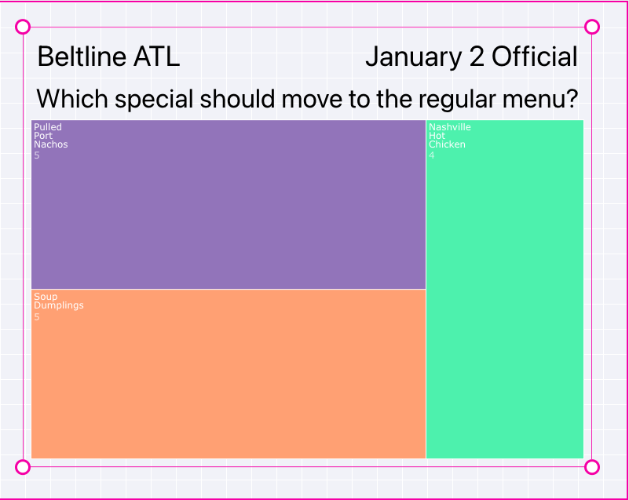

<i class="fa-solid fa-arrow-up"></i>

# Dashboard
{: .no_toc }

<i class="fa-solid fa-arrow-up"></i>

  

    Quick Links
  

  {: .text-delta }
- Quick Links
{: toc}

## What is a Dashboard?

A Dashboard is a URL that can be embedded in an iFrame or used directly in a browser to show real-time results from your Questions/Answers.  Dashboards will only show "Active" campaigns.  You may not show a Dashboard with a "Draft" or "Inactive" Campaign.  Each time someone scans an Answer, the interface will udpate in real-time.  So, if you sent out fliers asking people to vote for which new company logo to use, you could put an iFrame on your main web page and see the real-time votes display in that iFrame.  Or, you can just show the dashbaord as a full web page.  There are many different kinds of graph types and analytics that can be displayed.  Here is a sample Dashboard:

  

  
  

{: .note }
> If you do not see any data in your Dashboard, make sure you have made your Campaign Active in [Campaign Setup](../projects.html#setup).

## Dashboard Web Interface

Go to https://dev.dashboards.qr-answers.com for the user interface.  You log in with the same credentials you would with app.qr-answers.com.   You must be marked as a Developer in the Team Management area of your Administrator's account.  If you are not the Administrator, contact your Administrator for them to add you as a Developer under Team Management.  Anyone you give a dashboard URL to will be able to view it, but only Developers marked in your Administrator's account will be able to create dashboards.

## Sign In

If you are not already logged in, you will be prompted with a Sign In dialog box, as below:

  

  
  

After you sign in, you will see the main interface to start creating or editing your Dashboards.  It may take a few seconds for the Data Selection accordion to populate the 'Add Results' button.  During this brief wait, the system is loading your Projects, Campaigns, Locations and Questions so you may choose what things you would like to graph in your Dashboard.

  

  
  

## Choosing a Data Source

After the information is loaded, you will see this:

  

  
  

The first thing you want to do is pick what data you are trying to display.  Ultimately, what you are trying to do is show results from your Questions - how many people voted for which Answer.  You may do that by picking a specific Question at a specific Location or you may choose a Question at the Project level and pick and choose which Locations and Campaigns you want to include in your graph.  

In the first case, to show results of a specific Question at a specific Location (recall you can have the same Question at multiple loactions).   Select the Add Results button and you will be presented with an accordion pick list of your Projects.  Navigate down your Project to CAMPAIGNS, then choose a specific Campaign.  At that point you will be presented a list of all the Locations for that Campaign and under each Location, you will have the list of Questions that were presented at that Location.  Choose the Question you would like to see the results for.

For example, below you see a list of Projects ("New Test Project", "Dashboards Project", "Drivers", and "Yum Yum").  We chose "Yum Yum". 

  

  
  

You will see QUESTIONS and CAMPAIGNS.  Skip QUESTIONS for now.  Click on Campaigns to see the list of Campaigns - we chose "January 2 Official" as the Campaign.  You will see under that Campaign, the three Locations where we ran the Campaign:  "Beltline ATL", "Midtown ATL" and "River Street Savannah".  

  

  
  

We want our Dashboard to display the Question <i>"Which special should we move to the regular menu?"</i> results.  So, we clicked on that Question and the accordion goes away and you will see a vertical bar chart sized to 1/4 the screen size to start with.  You will also see "New Graph 1" under the Data Selection accordion.  The name is for your reference only. It will not show up in the resulting Dashboard displayed to the end user.  You may change the name by long-pressing on the name.  This can be useful to distinguish between different graphs on a Dashboard with multiple graphs.

  

  
  

## Changing Properties

You may change the graph type (vertical/horizontal bar, pie, line, etc.), and the properties of the graph (background color, font sizes, etc.) by selecting the graph on the design surface (you will see the grab handles in the four corners like below), then choose the Graph Type or Graph Settings to pick individual properties.

  

  
  

### Resizing and Moving the Graph

Select the graph by clicking on it (see above) and then you may drag it around the surface or resize it by choosing the resize handles or outlines.  Below we have made it nearly the full size of the design surface.  After resizing and moving it, we selected Graph Type

  

  
  

### Graph Type

You may change the Graph Type by selecting a different icon from the Graph Type accordion.  From the top left, going down the left side, then back to the top, the graph types are:  Vertical Bar (includes graoup bar), Stacked Vertical Bar, Horizontal Bar (can be grouped), Stacked Horizontal Bar, Segmented Line, Smoothed Line, Area Fill, TreeMap, Pivot (not a graph, just data), Pie, Donut, Sunburst (for hierarchical graphs), and Packed Circle.  Play with each type to see what you like.  The stacked and grouped charts will come in later when we cover graphing multiple Locations and Campaigns. For a single Question, the 'stacked' versions of the charts will be no different than the regular bar charts - since there is only 1 Location and Campaign represented in our example.

Below we have included samples of the TreeMap and Pivot.  We'll leave it up to you to play with the different types and your own data.

  

  
  

  

  
  

#### Pivot

You may also pivot the data for some of the different graph types.  Again, play with this to see which presentation you would like to use.  Below is the Vertical Bar and Pivot charts, but with the 'pivot' checkbox checked.  Note that pivoting the data will also allow you to use any images you may have as part of your answers as the 'fill' of the bar instead of a color - we'll cover this later.

  

  
  

For the bar chart, you'll notice that the bars are diffrent colors and the Legend shows the Answers vs. the non-pivot version above shows the same color bars and the Answers along the bottom.

  

  
  

Scroll up to the above Pivot chart and compare it to this one.  You'll see that the rows habe been turned into columns.

#### Use Answer Image as Fill

The button titled Use answer images as fill - will be active *only* if your Answers have images as part of the Answer.  For example, if you were picking your favorite fruit - your answers may have a picture of an orange, pineapple and apple.  You may press this button to fill the bars with your image vs. a color.  In our example related to the work settings, we added Images as part of the Answer so that when the end-user votes,  they see both the text answer and the associated image.  [Look here](../projects.html#edit-answer-details).  If your Answers have images, then this button will highlight and you may have the bars or 'filled' parts of the graph use your Answer image as the fill.  If you switch between graph types, you may need to press this button again to apply your images.  Some graph types don't have the 'image fill' ability, so the property will 'go away' if you switch from a graph supporting image fill and one that doesn't.

  

  
  

### Graph Settings

The Graph Settings accordion allows you to place the graph manually (vs. drag/stretch), set the Container background color and to display and style the Location and Campaign labels.

  

  
  

#### Location and Size

You may use the grab handles to drag and resize the graph, or if you need precise positioning, you may use the X, Y, Width and Height % values.  They will display the current settings for the graph.  These settings are all given in percentages.  The percentages are the location based on the design surface size (you may change the design surface aspect ratio under the Dashboard Settings accordion).  When you first select a Data source to graph, it will be placed at 25% X and Y and 50% Width and Height.  So, it will be centered in the design surface and be 1/4 the size of the overall design surface.  

If you are going to place multiple graphs on a single design surface, it is sometimes useful to make them the same width and height.  Size one of the graphs to the dimensions you would like, then you may press the copy icon <i class="fa-solid fa-copy"></i> to save the Width and Height.  Then, select the 2nd graph and press the paste <i class="fa-solid fa-paste"></i> icon.  That will make both graphs the same size.  If you have a Width/Height that you have copied, the 'paste' icon will highlight.  Any time a paste icon is highlighted, you may paste those values onto a new graph.

#### Container Background Color

The Container is the area directly surrounding the graph. If you have selected the graph, then the Container is that area inside the pink outlines and grab handles.  You may change the color of the Container by selecting the color picker and choosing a color.  The display is interactive, so drag around to choose a color and press Save.  If you click off of the dialog or press Cancel, the choice will be reverted.

  

  
  

#### Text Attributes

The area above the graph has additional text attributes like Location (upper left), Campaign (upper right) and Question (between the graph and the Location/Campaign).  You may hide any of these or change their colors and font.  For example, to hide the Location, press the eye <i class="fa-solid fa-eye"></i> icon next to the Text Attributes Location label.  The icon will change to have a line though it <i class="fa-solid fa-eye-slash"></i> (indicating you are hiding the Location), and the Location will be removed from the Container.

  

  
  

You may hide or show the Location name, Campaign name or Question text using this same methodology.  You may also change the font color and style by choosing those controls.  Below, we have set the Campaign and Question text to be white, the Campaign text to be italic and the Question to be bold.  As indicated above, if you have 2 graphs, you can copy the Text Attributes settings by pressing the copy icon and then choosing the other graph and choosing the paste icon.

  

  
  

### Dashboard Settings

The Dashboard Settings accordion allows you to control the Grid snap, Destination aspect ratio and Dashboard (design surface) color.

#### Grid Snap
To control whether the drag and resize snaps to a grid you may modify thes Grid Snap settings.  The default grid size is 5.  You may decrease this to 1 for the finest control, or increase it as you see fit.  The link <i class="fa-solid fa-link"></i> icon allows you to change both x and y grid values simultaneously by modifing the x value on the left.  To change them independently, press the link icon and it will change to this <i class="fa-solid fa-unlink"></i>.

#### Destination Aspect

The default design surface fills the screen.  When you deploy your Dashboard, it will fill whaever iFrame or window that you are displaying the URL in.  If you would like to change the aspect ratio of the destination, you may select one from the "Destination Aspect" ratio dropdown.  Fit is the default to fill the screen.  Below, we changed the last graph that used Fit to be 3:1.  You will see the design surface (the area with the background grid), has resized itself to a 3:1 aspect ratio.  Your designer may only have a certain amount of space on a web page (in an iframe for example) to place this graph and allowing them to design the graph to the same aspect as the destination will help.

  

  
  

#### Dashboard Color

The area in the Dashboard not covered by the graph or Container can be colored as well.  Chosoe a Color from the color picker to change the overall background.  Here we chose a very dark blue.  Keep in mind that the grid lines will not show up in the resulting Dashboard.

  

  
  

### Themes

For any graph you may Apply or Save a theme.  Before applying a theme, you need to save one.  Make the visual presentation changes to the graph (colors, sizes, fonts, etc.) and then go to this Themes accordion.  Choose Save Theme to bring up a dialog box to save your theme.  You may name it when you save it and refer to it later when you want to Apply it to another graph.  You may also delete any themes from the Apply Theme dialog box.

  

  
  

The next image shows how we messed up the design of the above graph - changed background colors, fonts, etc.

  

  
  

Then, we select the graph, choose the Apply Theme... button and choose our previously saved theme from the dialog.  You'll see that it applies the saved theme to the graph and container.  However, it does *not* change the dashboard background.  Themes are only applied to the Container and Graph area of the selected graph.

  

  
  

## File Menu

The File menu is used to access Dashboards.  You may create a 'New' one, open an existing one, Save or Save As a dashboard.  These work like a normal file menu, so we will only cover a few items.

### Search

You may type any search string and the list of Dashboards will be reduced to match your search term.

### Username

The Username column will display the username of the person that saved the Dashboard.  You will only be able to see those Dashboards that you have access to from the Project settings of your Administrator's account.

### Live URL

For any saved Dashboard, you may retrieve the public URL for that Dashboard by selecting the copy <i class="fa-solid fa-copy"></i> icon in the Dialog.  This will copy the URL to your copy buffer.  You may paste it into an email or an iFrame source, etc.

### Delete

Selecting the trash can <i class="fa-solid fa-trash"></i> icon will delete the listed Dashboard.  It will ask if you are sure first.  If you delete the Dashboard, the public URL will no longer be valid.

## User Menu (circled letter)

The 1st letter of your username will appear in a circle in the upper right of the screen.  If you are a member of more than one team (your Administrator controls who is on a team and who has access to which Projects via [Manage Team](../menu/home_menu.html#team)), you may change teams by selecting this menu and choosing "Change Team".  You may also "Sign Out".

  

  
  

