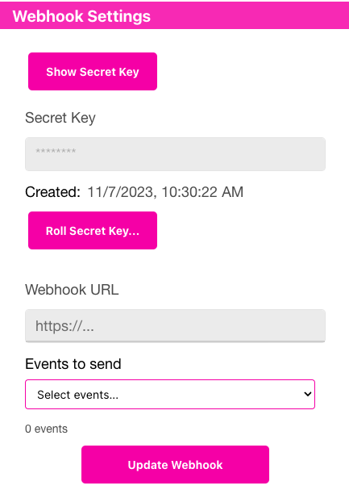

<div class="sticky-gotop">
<span class="inline-icon"><i class="fa-solid fa-arrow-up"></i></span>
</div>

# Webhook
{: .no_toc }

<div class="sticky-gotop">
<span class="inline-icon"><i class="fa-solid fa-arrow-up"></i></span>
</div>
<div class="sticky-right">
<details markdown="block">
  <summary>
    Quick Links
  </summary>
  {: .text-delta }
- Quick Links
{: toc}
</details>
</div>

## Webhooks
A webhook is used to receive events from the qr-answers backend.  You may select which events you receive by going to the [Developer](../menu/home_menu.html#developer) accordion and selecting the events you would like.  You also need to setup a URL where the qr-answers API backend can post events to.  This is called the Webhook URL.

  <p align="center" class="screen-shot">
  
  </p>

You need to have a Secret Key as well.  Keep this Secret Key guarded so no one else can access it.  It is used to package the data that is sent to your webhook so you can verify that the sender is really qr-answers.com.   If your Secret Key is compromised, generate a new one by choosing the <span class="inline-button">Roll Secret Key</span> button.

An easy configuraiton to create a webhook is to use Express.  You can setup a simple post route that will receive the messages from qr-answers.com.  You also need to install the qranswers module from npm.  This will allow you to verify the payload sent to you by calling the ```constructEvent``` method - which verifies the integrity of the package by utilizing your Secret Key.  Notice we do not 'hard code' the keys into the application.  They are set as Environment variables so that they aren't generally available for someone to access.  We use AWS Lambda to host the Webhooks - which allow you to set local Environment variables.

Here is a simple setup using Amplify and an AWS Lambda for the webhook:

```

const express = require('express')
const bodyParser = require('body-parser')
const awsServerlessExpressMiddleware = require('aws-serverless-express/middleware')
const crypto = require('crypto');

// Be sure to: npm install qranswers
const qranswers = require("qranswers")(process.env.QRANSWERS_API_KEY);      // Your regular API key
const endpointSecret = process.env.QRANSWERS_ENDPOINT_SECRET;               // Your Secret Key


// declare a new express app
const app = express()
app.use(
  bodyParser.json({
    verify: function(req, res, buf) {
      req.rawBody = buf;
    }
  })
);

app.use(awsServerlessExpressMiddleware.eventContext())

// Enable CORS for all methods
app.use(function(req, res, next) {
  res.header("Access-Control-Allow-Origin", "*")
  res.header("Access-Control-Allow-Headers", "*")
  next()
});

app.post('/qrhook', function(req, res) {

  const sig = req.headers['x-qr-signature'];
  let event
  try {
    event = qranswers.webhooks.constructEvent(req.rawBody, sig, endpointSecret)
  } catch (err) {
    console.log('Error', err);
    res.json({error: `Webhook Error: ${err.message}`});
    return;
  }

  switch (event.type) {
    case 'vote.evResponseVote':
      const data = event.data.object;
      console.log('Received evRsponseVote:', event);
      break;
    case 'vote.evRawVote':
      const data = event.data.object;
      console.log('Received evRawVote:', event);
      break;

  }

  res.json({success: 'post call succeed!', url: req.url, body: req.body})
});

app.listen(3000, function() {
    console.log("App started")
});

// Export the app object. When executing the application local this does nothing. However,
// to port it to AWS Lambda we will create a wrapper around that will load the app from
// this file
module.exports = app

```

The 'vote.evResponseVote' event is sent when someone scans a QR code Answer for one of your Questions.  You will receive the baseId of the specific Question (scoped by Campaign and Location) as well as the projectId and answerId.  In addition, you will receive the *aggregate* count of votes received for that Answer.  Note this is the aggregate amount of votes received for that Answer vs a single up or down vote.  You may also receive detailed information about each vote processed by registering for the 'event.evRawVote' as described below. Below is the format of the 'vote.evResponseVote' event data:

```
{
  id: f157583d-3a2e-fa44-23eb-ec264dd6d697,
  object: 'event',
  api_version: '2023-09-18',
  created: 1701406737583,
  type: 'vote.evResponseVote',
  data: {
    object: {
      id: '6dbbffc8-4742-4bb5-9732-405c1XXXXXXX_54a2d820-1808-43f6-a48d-1d8b2XXXXXXX_f366dee6-1b48-4f11-9376-cbbd3XXXXXXX_f76c45a0-40ab-4d66-8dbb-27f10XXXXXXX',
      object: 'vote',
      clientId: '14c23315-3583-4f27-865d-56af2b73b4fXXXXXXX',
      projectId: 'f6b90ccd-7c68-46de-bb67-ff331XXXXXXX',
      answerId: '4a7ffac3-c524-44d6-a900-32d3cXXXXXXX',
      count: '30'
    }
  }
}
```

The 'vote.evRawVote' is sent to your Webhook (provided you register for it under the [Developer accordion](../menu/home_menu.html#webhooks)).  This is an individual vote that may have a vote of +1 or -1.  You may get a -1 value here if your Campaign is set to log only a single vote for an end user.  If the person has already voted (say for "Yes"), but they want to change their answer to "No", when they scan the "No" you will get a 'vote.evRawvote' for the -1 vote for "Yes" *and* a +1 vote for "No".  

There are several values here that may be useful.  The data.object value will be 'evRawVote'.  The clientId will be the clientId assigned to your master account.  The projectId is the identifier for the particular Project that the scan references.  The questionLocationId is the identifier that scopes the Question to a particular Location in a particular Campaign. (Keep in mind, you can use the same Question in multiple Locations}. The locationId, questionId, answerId are identifiers for those objects.  The schedule will reflect what schedule was chosen for the Campaign Settings and conditionally the current date/time information. Where a hash mark is shown (#), the character is actually the hash mark (#). The schedule will be one of:  

hour#YYYYMMDD#hh - where YYYY is the year; MM is the two digit month; DD is the two digit day; hh is the hour 0-23

day#YYYYMMDD - where YYYY is the year; MM is the 2 digit month; DD is the two digit day

onetime# - there are no fields after the #

nolimit# - there are no fields after the #

none# - there are no fields after the #

The userId is an arbitrary value assigned to the user.  If the same user scans another QR code, you may or may not get the same userId.  The eventId is an arbitrary value assigned to the event that QRAnswers uses internally.

Below is the format of the 'vote.evRawVote' data:

```
{
  id: 'd3875f15-3ea2-44fa-be23-976dd111ab',
  object: 'event',
  api_version: '2023-09-18',
  created: 1701406739643,
  type: 'vote.evRawVote',
  data: {
    object: {
      object: 'evRawVote',
      clientId: '14c23315-3583-4f27-865d-56af2bXXXXXXX',
      projectId: 'f6b90ccd-7c68-46de-bb67-ff331XXXXXXX',
      questionLocationId: '54a2d820-1808-43f6-a48d-1d8b2XXXXXXX',
      locationId: 'f366dee6-1b48-4f11-9376-cbbdXXXXXXX',
      questionId: 'f76c45a0-40ab-4d66-8dbb-27f10XXXXXXX',
      answerId: '4a7ffac3-c524-44d6-a900-32d3cXXXXXXX',
      schedule: 'nolimit#',
      vote: 1,
      createdAt: '2023-12-01T04:58:57.583Z',
      userId: 'b0c72ddd-9d6e-4e59-9b9b-1c4a3XXXXXXX',
      eventId: '9e7a176f-820b-4a78-8409-97a1dXXXXXXX'
    }
  }
}
```