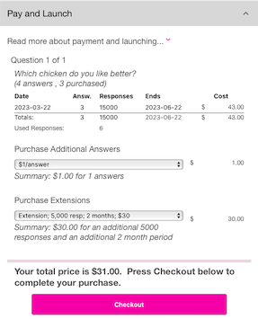

# Home Menu
{: .no_toc}

<i class="fa-solid fa-arrow-up"></i>

  

    Quick Links
  

  {: .text-delta }
- Quick Links
{: toc}

## Menu <i class="fa-solid fa-bars"></i>
In the upper right corner of the Home tab is the 3 bar menu.  This menu allows you to Edit Profile (Change Password, Team Membership, Billing, Transfer Ownership, Terminate Service), Manage Plan (Team Information, Team, Plan Limits, Plan Features, Plan Notifications), Request Export (raw data), Download Export, or Log Out.

  

  
  

### Edit Profile
Below are the sections after choosing **Edit Profile**.

#### Change Email

Change Email

Only you may change your email address.  If you are a member of some other person's Team, they will not be able to change your email address.  Your email address is not used by the other Team after you have accepted an invitation.  You are given an internal identifier that will follow you around, even if you change your email address.  You will be required to enter your old email address as well as your new one to change it.

  

  
  

#### Change Password

Change Password

Your username will show at the top of the section, followed by a place to enter your old password and to enter your new password and confirm it.  Once you hit the Update button, your password will be reset.  If you forget your password, see the [Forgot Password](./account/signin#forgot-password) section.

  

  
  

#### Team Membership

Team Membership

If you are the owner of the team account, then you will see the below screen.

  

  
  

If you choose the checkbox and the Remove Me button, then you will see the below dialog:

  

  
  

Since you are the only member, then removing you effectively is terminating your service.  You should choose the Termiante Service accordion to do this, as there are more options.

You become a member of more than one team by accepting an invitation from someone else to join their Team.  You will receive an email from the inviting person.  After receiving an invitation, if you create an account or log in, you will be added to the inviting person's team.

If you are a member of multiple teams, you will see them all listed here.  You may remove yourself from any of the teams listed by checking the box next to the team name and choosing the Remove Me button.

#### Billing

Billing

The Billing section will contain **all** of the transactions you have had.  TODO TODO TODO

#### Transfer Ownership

Transfer Ownership

If you are the owner of an account, then you may transfer ownership to another person that has been added to your team.  So, if you are the only person on your team, then you will need to add someone to your team via the main menu's Manage Plan item, then choose the Team accordion.  Transfering ownership will allow the receiver 30 days to sign in and update the billing information to take ownership of the account.  All Projects, Campaigns, Locations, Questions, etc. will transfer to the new owner.  Below is the screen you will see if you try to transfer ownership and there is no one else on your team.

  

  
  

If you have other team  members, you will see them listed like below.  Choose the team member you wish to transfer the account to and select the Confirm Transfer button.

  

  
  

#### Terminate Service

Terminate Service

If you are finished using QR-Answers (we hope not), you may terminate your service in this section. Please see our policy regarding payment plans and termination for a full overview.  In general, if you choose this option, your plan will terminate on the next billing cycle of your plan. So, if it bills monthly, the following month will be the effective date of termination.  If it bills yearly, then on the year anniversary is when the termination will be effective.

  

  
  

There are 2 options:

<i class="fa-regular fa-circle"></i> Cancel Service - disable and archive data

This option will mark all of your data as archived in our backend and remove your user account.  You may contact us at a later date to re-enable your account and data.  We will only hold onto your archived data for no more than 60 days.  After that, the data will be removed and we will be unable to restore it.

<i class="fa-regular fa-circle"></i> Delete Service - permanently remove data - cannot be undone

{: .warning }
> This is irreversible.  Once you select this option and choose Update, you will be prompted to make sure you are positive that's what you want to do.  If you respond Yes to terminate the service, your data is gone for ever and we will be unable to restore any of it.

### Manage Plan
Below are the sections after choosing **Manage Plan**.

#### Team Information

Team Information

The Team Information section shows who the billing contact is and when the subscription period started and renews.  This section also allows you (if you are the owner or designated Administrator) to change the Team name.

  

  
  

#### Team

Team

This section allows you to manage your team.  You may add people (if you have a subscription that allows that) as well as see your current list of team members and update or remove them.  Click the Manage Team to manage your team.

  

  
  

Clicking Manage Team will show the Confirmed Members and Invitations accordions below.

##### Confirmed Members

Confirmed Members

Click on this accordion to show a list of your current team members.  If you have invited someone, but they have not yet accepted, you will see those names under the Invitations accordion.

  

  
  

Clicking on a the edit <i class="fa-solid fa-pen-to-square"></i> icon next to the member email will allow you to edit their permissions.

###### Member Permissions
As the owner of the account, you may not edit your own permissions.  They are fixed when you create the account.  However, you may edit any other member's permissions.  Clicking on the edit icon next to the member's email address will bring up a screen similar to the below.  You will be unable to edit that person's email address, as they are in control of their own email.  If you are trying to switch out a team member with a new one, then remove the old one and invite the new one.

  

  
  

There are 3 types of Roles you may assign to a team member.

1) Administrator - that will give this team member the ability to do everything the 'owner' can do, <i>except</i> invite other users.  If you also check th "Can invite other users", then this team member has the ability to add new team members to your team.

2) Auditor/Analyst - this allows the team member to look at all projects and download voting data, but it does not allow them to modify any of the Projects.  This person could be a 3rd party accountant or auditor that is looking at the results of your Projects.

3) Project Administrator - this allows the team member to manage particular Projects (those that you check in the list).  They will not be able to access any other Projects than the ones that are checked.  You may give them Modify privileges (which makes them an Administrator at the Project level) or Readonly (which gives them an auditor/analyst like privilege at the Project level).  If you choose Modify, then you may also allow them to invite other users to their Project team by checking the Add Users checkbox.

{: .note }
> If you select Project Aministrator, it will list all of the Projects you have created below it in a table.  In the above example, there are 2 Projects - Herman Miller and Knoll.  This user will only be allowed to access the Herman Miller Project.  If you click Administrator or Auditor/analyst, the Project list will disappear.

##### Invitations

Invitations

To add team members to your team, click the Invitations accordion and it will open.  If you have pending Invitations (invitations that were sent, but that person has not logged in), they will show up in this list.  You will also see the plus sign <i class="fa-solid fa-square-plus"></i> Add button.  

  

  
  

If you have available space on your team (based on your subscription plan), you will be able to press that button and add a new team member.  If you do not have any available team member positions, you will need to add more people to your membership under the XXX tab.  The below screen will display after you press the Add button.

  

  
  

Enter the user's email address (this email is what they will have to use to sign up), then enter the Role you would like them to play.  See  [Member Permissions](#member-permissions) above.  After you click Update, you will see a confirmation that the user has been added and a <u>Click Here</u> link that you may press to generate an email to your new team member.  This link uses the mailto: protocol, so it will try to launch your default mail client.  If the link does not work, you can email them the text that is shown below in the "Join my Team on QR-Answers" email.

  

  
  

Below is the sample email that is generated after you confirm adding your new team member.

  

  
  

#### Plan Limits

#### Plan Features

#### Plan Notifications

Plan Notifications

Currently, the only notification setting is Notify Me of Response Limits via Email.  The default is 'on'.  When you purchase a subscription, there is a pre-defined number of responses (votes) and a timeframe associated with all of your Campaigns.  If you are getting more responses than you thought, you will get an email notification letting you know that you have run out of responses (number left is 0).  You can increase your limit by going to the TODO XXXXXXX [section]() of the TODO XXX page.  Below is a sample where a new Answer was added **and** a Purchase Extension was chosen to add 5,000 responses and 2 more months.  

  

  
  

In addition, you will get notifications for every 25% overage that you have.  So, if you initially paid for 5,000 responses and you now have 6,250 responses, you will get an email letting you know you are over your limit.  For every 25% over, you will get a new email until the campaign time runs out, or you pay for the overage.  Your campaigns will still be recording votes when you go over your response limit, however, you will not see them unless you go back to the [Pay and Launch](./contests/pay_launch#purchase-question-and-answers) section and purchase the overage responses by selecting Purchase Responses to Offset Overage of X Responses - where X is the number of responses you are over.  You should try go guess accurately how many responses you will get, as the overage price is slightly more than if you had purchased enough responses in the beginning. Once you pay for the overage, your Responses will show up in your [Results](results).

### Request Export
Choosing this and confirming will trigger our servers to generate a download file for you with all of your data.  You will receive an email when the data is ready. Click on the link in the email to retrieve your data, or you may come back to the Home page Menu and choose Download Export to download the data.

### Download Export
After requesting an export from above, you may go here to download any export.  You will see a list of available exports ordered by time.  The exports are valid for TODO XXX days.

### Log out
Pretty self explanatory. Click this to log out.

