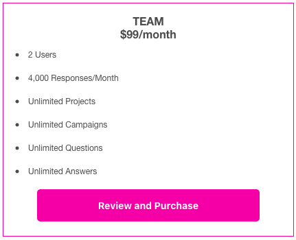

# Home Menu
{: .no_toc}

<div class="sticky-gotop">
<span class="inline-icon"><i class="fa-solid fa-arrow-up"></i></span>
</div>
<div class="sticky-right">
<details markdown="block">
  <summary>
    Quick Links
  </summary>
  {: .text-delta }
- Quick Links
{: toc}
</details>
</div>


## Menu <span class="inline-icon"><i class="fa-solid fa-bars"></i></span>
In the upper right corner of the Home tab is the 3 bar menu.  This menu allows you to Edit Profile (Change Password, Team Membership, Billing, Transfer Ownership, Terminate Service), Manage Plan (Team Information, Team, Plan Limits, Plan Features, Plan Notifications), Request Export (raw data), Download Export, or Log Out.

  <p align="center" class="screen-shot">
  
  </p>

### Edit Profile
Below are the sections after choosing **Edit Profile**.

#### Change Email
<div class="accordion-bar">Change Email</div>
Only you may change your email address.  If you are a member of some other person's Team, they will not be able to change your email address.  Your email address is not used by the other Team after you have accepted an invitation.  You are given an internal identifier that will follow you around, even if you change your email address.  You will be required to enter your old email address as well as your new one to change it.

  <p align="center" class="screen-shot">
  
  </p>

#### Change Password
<div class="accordion-bar">Change Password</div>
Your username will show at the top of the section, followed by a place to enter your old password and to enter your new password and confirm it.  Once you hit the <span class="inline-button">Update</span> button, your password will be reset.  If you forget your password, see the [Forgot Password](./account/signin#forgot-password) section.

  <p align="center" class="screen-shot">
  
  </p>

#### Team Membership
<div class="accordion-bar">Team Membership</div>
If you are the owner of the team account, then you will see the below screen.

  <p align="center" class="screen-shot">
  
  </p>

If you choose the checkbox and the <span class="inline-button">Remove Me</span> button, then you will see the below dialog:

  <p align="center" class="screen-shot">
  
  </p>

Since you are the only member, then removing you effectively is terminating your service.  You should choose the <span class="inline-accordion">Termiante Service</span> accordion to do this, as there are more options.

You become a member of more than one team by accepting an invitation from someone else to join their Team.  You will receive an email from the inviting person.  After receiving an invitation, if you create an account or log in, you will be added to the inviting person's team.

If you are a member of multiple teams, you will see them all listed here.  You may remove yourself from any of the teams listed by checking the box next to the team name and choosing the <span class="inline-button">Remove Me</span> button.

#### Billing
<div class="accordion-bar">Billing</div>
The Billing section will contain **all** of the transactions you have had.  TODO TODO TODO


#### Transfer Ownership
<div class="accordion-bar">Transfer Ownership</div>
If you are the owner of an account, then you may transfer ownership to another person that has been added to your team.  So, if you are the only person on your team, then you will need to add someone to your team via the main menu's Manage Plan item, then choose the <span class="inline-accordion">Team</span> accordion.  Transfering ownership will allow the receiver 30 days to sign in and update the billing information to take ownership of the account.  All Projects, Campaigns, Locations, Questions, etc. will transfer to the new owner.  Below is the screen you will see if you try to transfer ownership and there is no one else on your team.

  <p align="center" class="screen-shot">
  
  </p>

If you have other team  members, you will see them listed like below.  Choose the team member you wish to transfer the account to and select the <span class="inline-button">Confirm Transfer</span> button.

  <p align="center" class="screen-shot">
  
  </p>

#### Terminate Service
<div class="accordion-bar">Terminate Service</div>
If you are finished using QR-Answers (we hope not), you may terminate your service in this section. Please see our policy regarding payment plans and termination for a full overview.  In general, if you choose this option, your plan will terminate on the next billing cycle of your plan. So, if it bills monthly, the following month will be the effective date of termination.  If it bills yearly, then on the year anniversary is when the termination will be effective.

  <p align="center" class="screen-shot">
  
  </p>

There are 2 options:

<span class="inline-icon"><i class="fa-regular fa-circle"></i></span> Cancel Service - disable and archive data

This option will mark all of your data as archived in our backend and remove your user account.  You may contact us at a later date to re-enable your account and data.  We will only hold onto your archived data for no more than 60 days.  After that, the data will be removed and we will be unable to restore it.

<span class="inline-icon"><i class="fa-regular fa-circle"></i></span> Delete Service - permanently remove data - cannot be undone

{: .warning }
> This is irreversible.  Once you select this option and choose <span class="inline-button">Update</span>, you will be prompted to make sure you are positive that's what you want to do.  If you respond Yes to terminate the service, your data is gone for ever and we will be unable to restore any of it.

### Manage Plan
Below are the sections after choosing **Manage Plan**.

#### Team Information
<div class="accordion-bar">Team Information</div>
The Team Information section shows who the billing contact is and when the subscription period started and renews.  This section also allows you (if you are the owner or designated Administrator) to change the Team name.  This section will only show up if you have Administrator access.

  <p align="center" class="screen-shot">
  
  </p>


#### Team
<div class="accordion-bar">Team</div>
This section allows you to manage your team.  You may add people (if you have a subscription that allows that) as well as see your current list of team members and update or remove them.  Click the <span class="inline-button">Manage Team</span> to manage your team.

  <p align="center" class="screen-shot">
  
  </p>

Clicking <span class="inline-button">Manage Team</span> will show the <span class="inline-accordion">Confirmed Members</span> and <span class="inline-accordion">Invitations</span> accordions below.

##### Confirmed Members
<div class="accordion-bar">Confirmed Members</div>
Click on this accordion to show a list of your current team members.  If you have invited someone, but they have not yet accepted, you will see those names under the <span class="inline-accordion">Invitations</span> accordion.

  <p align="center" class="screen-shot">
  
  </p>

Clicking on a the edit <span class="inline-icon"><i class="fa-solid fa-pen-to-square"></i></span> icon next to the member email will allow you to edit their permissions.

###### Member Permissions
As the owner of the account, you may not edit your own permissions.  They are fixed when you create the account.  However, you may edit any other member's permissions.  Clicking on the edit icon next to the member's email address will bring up a screen similar to the below.  You will be unable to edit that person's email address, as they are in control of their own email.  If you are trying to switch out a team member with a new one, then remove the old one and invite the new one.

  <p align="center" class="screen-shot">
  
  </p>

There are 3 types of Roles you may assign to a team member.

1) Administrator - that will give this team member the ability to do everything the 'owner' can do, <i>except</i> invite other users.  If you also check th "Can invite other users", then this team member has the ability to add new team members to your team.  If you check 'Has developer access', this enables the user to acess the Developer APIs and features described [here](../developer/).

2) Auditor/Analyst - this allows the team member to look at all projects and download voting data, but it does not allow them to modify any of the Projects.  This person could be a 3rd party accountant or auditor that is looking at the results of your Projects.

3) Project Administrator - this allows the team member to manage particular Projects (those that you check in the list).  They will not be able to access any other Projects than the ones that are checked.  You may give them Modify privileges (which makes them an Administrator at the Project level) or Readonly (which gives them an auditor/analyst like privilege at the Project level).  If you choose Modify, then you may also allow them to invite other users to their Project team by checking the Add Users checkbox.  If you check the Developer box, that will allow that user to access the [Developer](../developer/) APIs for that particular Project.

{: .note }
> If you select Project Aministrator, it will list all of the Projects you have created below it in a table.  In the above example, there are 2 Projects - Herman Miller and Knoll.  This user will be allowed to access the Herman Miller and Knoll Projects.  However, they may invite people to only the Herman Miller Project.  In addition you have given them access to the [Developer](../developer/) APIs for the Herman Miller Project. If you click Administrator or Auditor/analyst, the Project list will disappear.


##### Invitations
<div class="accordion-bar">Invitations</div>
To add team members to your team, click the <span class="inline-accordion">Invitations</span> accordion and it will open.  If you have pending Invitations (invitations that were sent, but that person has not logged in), they will show up in this list.  You will also see the plus sign <span class="inline-icon"><i class="fa-solid fa-square-plus"></i></span> Add button.  

  <p align="center" class="screen-shot">
  
  </p>

If you have available space on your team (based on your subscription plan), you will be able to press that button and add a new team member.  If you do not have any available team member positions, you will need to add more people to your membership under the Manage Plan -> [Subscription Plan](#subscription-plan) accordion.  The below screen will display after you press the Add button.

  <p align="center" class="screen-shot">
  
  </p>


Enter the user's email address (this email is what they will have to use to sign up), then enter the Role you would like them to play.  See  [Member Permissions](#member-permissions) above.  After you click Update, you will see a confirmation that the user has been added and a <u>Click Here</u> link that you may press to generate an email to your new team member.  This link uses the mailto: protocol, so it will try to launch your default mail client.  If the link does not work, you can email them the text that is shown below in the "Join my Team on QR-Answers" email.

  <p align="center" class="screen-shot">
  
  </p>

Below is the sample email that is generated after you confirm adding your new team member.

  <p align="center" class="screen-shot">
  
  </p>

#### Resources Used
<div class="accordion-bar">Resources Used</div>
This is an informational area showing you how many resources (Projects, Campaigns, etc.) are being used.  It also shows the number of Responses you have available and used.

  <p align="center" class="screen-shot">
  
  </p>


#### Subscription Plan
<div class="accordion-bar">Subscription Plan</div>
These options are subject to change.  We try to keep the help file sync'd up with the actual Plans, but occassionally they could be out of sync.

Plans are either billed Annually (saving up to 25%) or Monthly.  You may choose which plan you would like to use from this section.  An annual plan will last 12 months.  Monthly plans expire at the end of each month.  With either plan, you may choose to auto-renew the subscription by checking the 'Auto-renew subscription at period end' checkbox on the detail page of the subscription.

The difference between the plans are primarily how many users you have and how many responses per month you receive.  A Response is registered each time someone scans a QR coded answer.  The Individual Plan is limited to a single user.  The Team and Enterprise Plans allow you to add as many users as you like.  Responses can be added to any plan.  

There are a set number of responses included with each plan.  Additional Responses may be added in groups of 2,000 to any plan.  It is better to try to include the number of responses you think you may receive 'up front' when you initiate your subscription because it is slightly more expensive to add them later.  If you have an overage in any month (lots of people scanned your answers and you went over your quota), then you will see a notice under your subscription that there are Overage responses available to purchase.  If you purchase them, then they will be moved from 'overage storage' to be included in your Responses results. You are not required to purchase them, but they will not show up in your Results unless you do.  You may also add Responses at any time during your subcription period.  So, if you see you are getting more Responses than you thought you would, you can come back here and add more Responses before your reach an Overage condition.  Keep in mind that when you add Responses, you are adding them to each month left in your subscription. So, if you are four (4) months into an annual subscription and you add 2,000 Responses for $.03/response you will pay for eight (8) months * 2,0000 * $.03 = $480.  

The 'Iitial add-ons' section of the subscription page are changable only during your initial sign-up for a subscription.  Once you purchase the subscription, you will be unable to change these - so take the time to try to figure out how many users and responses you are going to need.  You may add additional users and Responses later for a slight increase in cost under the 'Mid-subscription upgrades' section that will show up after your initial purchase.  Alternatively, you may Upgrade your subscription to a higher level at any time and receive a full credit for the unused porition of your current subscription.

If your subscription expires and there are Responses that were received *after* your expiration date, they will show up here under your subscription and you will be able to purchase them if you like.


Subscriptions can be upgraded at any time with no 'penalty'.  If you want to cancel a subscription, then you click on the <span class="inline-button">Update Subscription</span> button under your Current Subscription (denoted by a green circle checkmark) and uncheck the 'Auto-renew subscription at period end'.  Your subscription will be canceled at the End of your Subscription Period.  So, if you are on a monthly plan, it will cancel effective at the end of the month.  If you are on an annual plan, it will cancel at the Period End Date shown by your Current Plan.  You may use the subscription until the Period End date.  

If you downgrade a subscription, it will downgrade effective on the Period End date.  If you upgrade a subscription, you will be credited for the amount paid for the unused time on your current subscription and your new subscription will deduct that as a credit for the new subscription. The renewal date will be set to the date you upgrade and the Period End date will be one period (month or year - depending on which plan you are choosing).

The long and short of this is that if you cancel, there is no refund or pro-rata credit.  The subscription will expire on the Period End date.  If you downgrade a subscription, it is similar to a cancel in that there is no pro-rata credit.  However, on the Period End date, your subsription will be reduced to whichever new plan you downgraded to.  If you are upgrading a subscription, you get full-credit for the unused portion of your 'old' subscription and it is applied to the new subscription rate - the caveat here is that the new subscription period start date will be set to the date you upgrade (as opposed to upgrading only for the time left on your old subscription).

Here are some examples:
...

##### Free
<div class="accordion-bar">Free</div>
The Free plan includes 2 users.  If you sing up for this, you are the Team Administrator and you may invite one other person to join your team.  See the Project Concept section for a high-level view on how to create your Questions. You may generate as many Projects, Campaigns, etc. as you like, but you are limited to the number of responses you get to 50 responses.  That means that your QR code answers may be scanned 50 times before your quota is reached and you must upgrade or discontinue use of the product.  There is also a one month subscription time limit.  So, your subscription will expire when either the 50 Responses are received or the one month period ends.  You may upgrade to a paid plan at any time and your Projects, Campaigns, etc. will carry over to that subscription.

  <p align="center" class="screen-shot">
  
  </p>


##### Individual Annual
<div class="accordion-bar">Individual Annual</div>
The Individual plan is for a single user.  You will be allowed 2,000 Responses per month with no limits on Projects, Campaigns, etc.  

  <p align="center" class="screen-shot">
  
  </p>

  <p align="center" class="screen-shot">
  
  </p>

##### Team
<div class="accordion-bar">Team Annual</div>
The Team Plan is for 2 users and 4,000 Responses per month.  The Team and Enterprise Plans highlight the collaborative features of the product with real-time updates across all users. You may assign particular users to only have access to specific Projects and Campaigns. See [Manage Team](#team) for more information.

  <p align="center" class="screen-shot">
  
  </p>

  <p align="center" class="screen-shot">
  
  </p>

##### Enterprise
<div class="accordion-bar">Enterprise Annual</div>
The Enterprise Plan includes 10 users and 25,000 Responses per month. The Team and Enterprise Plans highlight the collaborative features of the product with real-time updates across all users. You may assign particular users to only have access to specific Projects and Campaigns. See [Manage Team](#team) for more information.

In addition to having more Users and Responses the Enterprise Plan allows access to the rich underlying APIs and Dashboard construction features of the product.  See the [Developer](../developer/) section for an overview of all of the APIs.

  <p align="center" class="screen-shot">
  
  </p>

  <p align="center" class="screen-shot">
  
  </p>


This screen capture shows a person that has the Enterprise Plan as their current plan and it shows several options that were chosen as part of the plan - auto-renewal and some added responses (shown under the <span class="inline-button">Update Subscription</span> button).

  <p align="center" class="screen-shot">
  
  </p>

For any subscription, after you have purchased it, you may return to this page to see what other options may be available. For example, the below screen shows that the original subscription was for the Enterprise version with no Initial add-ons (Users or Responses).  It also shows that you may add a 'Mid-subscription upgrade' be adding additional Users ore Responses.  You'll see the User and Responses rate may be slightly higher than the initial subscriptino rate, so try to size your subscription correctly 'up front'.  If there are Responses that were received that are over your Monthly quota, they will show up here as a purchase option.

To cancel your subscription at the end of the period, uncheck the 'Auto-renew subsription at period end' checkbox and press the <span class="inline-button">Purchase</span> button.

  <p align="center" class="screen-shot">
  
  </p>

#### Billing Details
<div class="accordion-bar">Billing Details</div>
QR-Answrs uses Stripe (https://stripe.com/) to handle billing.  We do not store any of your credit card information.  This area will display a chronological list of successful billing activities with approximate amounts.  The reason they are approximate is that when the transactions are passed over to Stripe, Stripe takes the exact second that they receive the request and do pro-rata billing.  So, there may be a few pennies different between what is shown here and what Stripe shows on their portal.  There is a <span class="inline-button">Go to Stripe Portal</span> button in this section so that you may update your billing information or see your exact invoice history at any time.

  <p align="center" class="screen-shot">
  
  </p>


#### Notifications
<div class="accordion-bar">Notifications</div>
Currently, the only notification setting is <span class="form-label">Notify Me of Response Limits via Email</span>.  The default is 'on'.  When you purchase a subscription, there is a pre-defined number of responses (votes) and a timeframe associated with all of your Campaigns.  If you are getting more responses than you thought, you will get an email notification letting you know that you have run out of responses (number left is 0).  You can increase your limit by going to the <span class="inline-accordion">Subscription Plan</span> [section](#subscription-plan). 

In addition, you will get notifications for every 25% overage that you have.  So, if you initially paid for 5,000 responses and you now have 6,250 responses, you will get an email letting you know you are over your limit.  For every 25% over, you will get a new email until the campaign time runs out, or you pay for the overage.  Your campaigns will still be recording votes when you go over your response limit, however, you will not see them unless you go back to the [Subscription Plan](#subscription-plan) section and purchase the overage responses.  When you subscription you should try go guess accurately how many responses you will get, as the overage price is slightly more than if you had purchased enough responses in the beginning. Once you pay for the overage, your Responses will show up in your [Results](results).

#### Developer
<div class="accordion-bar">Developer</div>
To enable Developer features, you will need to accept the Terms and Conditions by checking the confirmation box provided.  You will then be provided developer credentials (API keys, access information, etc.) to take advantage of the numerous APIs, Dashboards and other features available to developers.  Each developer you enable will have to accept the Terms and Conditions.  You may add developers in the [Manage Teams](#team) area.  Full Developer help may be found [here](../developer/)

  <p align="center" class="screen-shot">
  
  </p>

After accepting the TOC, you will see these sections.

<div class="accordion-bar-qr">Standard Keys</div>
The Standard Keys section will show your API Key that will be used to access the REST APIs directly, or to pass to the qranswers module's ```require``` statement.  Keys are scoped to the specific Developer.  The Administrator/Owner of an account has a key that will allow access to all Projects.  Team members who are marked as developers will have API keys that are scoped only to the Projects they are allowed to access.  You give access to a Team member in the [Manage Team](#member-permissions) section.  You may change your API key by pressing the <span class="inline-button">Roll API Key...</span> button.  This will invalidate your old API key and replace it with a new one.  Any code using the 'old' API key will no longer run.  To see how to use this key, go to the [Developer](../developer/api.html) documentation.

  <p align="center" class="screen-shot">
  
  </p>

<div class="accordion-bar-qr">Public URL Keys</div>
The Public URL Keys section will display the API Key you should use when you are creating Dashboards for your customers.  That key is effectively a 'read-only' key and allows you or your end customers to display dashboards of results.  The key is appended to the dashboard URL to allow access to your results. You may change your Public URL key by pressing the <span class="inline-button">Roll API Key...</span> button.  This will invalidate your old Public URL key and replace it with a new one.  Any URLS that use the 'old' key will no longer run.  To see how to use these keys, go to the [Developer Dashboards](../developer/dashboard.html) documentation.

##### Webhooks
<div class="accordion-bar-qr">Webhook Settings</div>
QR-Answers supports webhooks for events generated by the qr-answers.com backend.  You may generate a secret key here that will be used in your webhook to verify inbound messages from the qr-answers backend.  You want to keep your Secret Key private so that no one else can spoof your system into believing the messages are from qr-answers.  You may disable your old Secret Key and create a new one by pushing the <span class="inline-button">Roll Secret Key</span> button.  This will invalidate the old key.

Enter the webhook URL where you would like qr-answers.com to send the messages generated.  You will receive messages for the chosen events at that URL.  Please review the [Webhook](../developer/webhook.html) documentation for all of the details.  You choose the events you would like to receive by selecting them in the <span class="form-label">Events to send</span> dropdown.  Currently, the only event generated (keep checking back here or follow the release notes) is the ```vote.evResponseVote``` event - which will notify you of any inbound Responses.

  <p align="center" class="screen-shot">
  
  </p>


### Request Export
Choosing this and confirming will trigger our servers to generate a download file for you with all of your data.  You will receive an email when the data is ready. Click on the link in the email to retrieve your data, or you may come back to the Home page Menu and choose Download Export to download the data.

### Download Export
After requesting an export from above, you may go here to download any export.  You will see a list of available exports ordered by time.  The exports are valid for TODO XXX days.

### Log out
Pretty self explanatory. Click this to log out.


