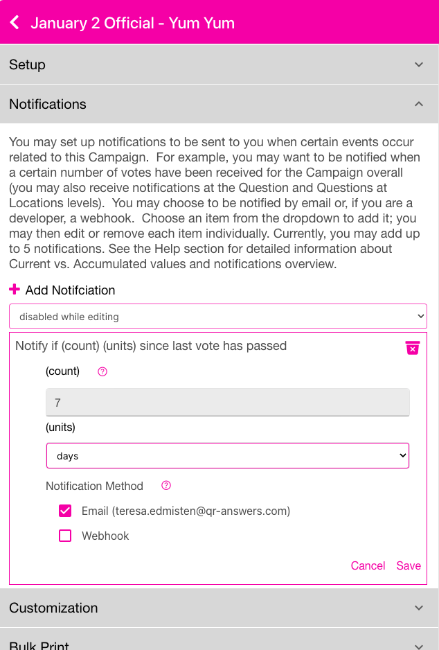

<i class="fa-solid fa-arrow-up"></i>

# deltaTime
{: .no_toc }

<i class="fa-solid fa-arrow-up"></i>

  

    Quick Links
  

  {: .text-delta }
- Quick Links
{: toc}

The DELTATIME notification will be triggered when you receive a vote, but you have not received one for some period of time.  The event happens when a vote occurs, this is not a notification that occurs if you do not get a vote in some period of time; it is a notifcation that occurs if you got a vote, *but* it hasn't been for a period of time.  Below shows putting a deltaTime Notification at the Campaign level.  You find this under the Campaign Notifications accordion.

  

   
    

For this Notifcation,  7 days have to pass bewteen votes for you to get the Notification.  You may choose Seconds, Minutes, Hours, Days, Weeks as the (units) and a whole number as the (count).  This notification isn't used that often.  Setting the (units) to seconds, for example, probably isn't appropriate unless you have a very high response rate like a televised poll or stadium scoreboard question/answer.