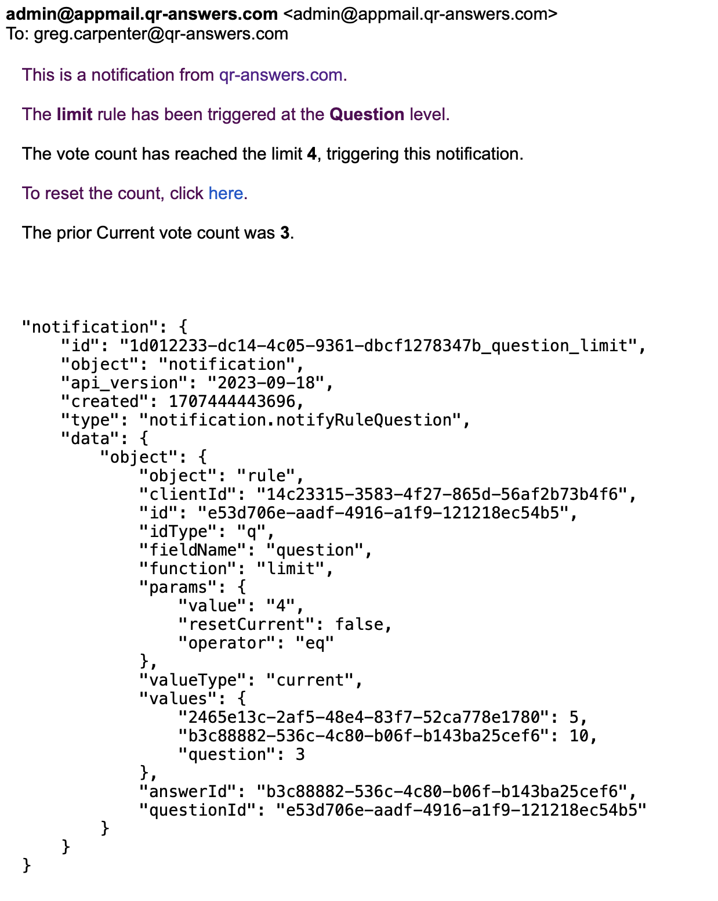

<div class="sticky-gotop">
<span class="inline-icon"><i class="fa-solid fa-arrow-up"></i></span>
</div>

# Email and Webhooks Notification
{: .no_toc }

<div class="sticky-gotop">
<span class="inline-icon"><i class="fa-solid fa-arrow-up"></i></span>
</div>
<div class="sticky-right" style="overflow-y: scroll; max-height: 90%">
<details markdown="block">
  <summary>
    Quick Links
  </summary>
  {: .text-delta }
- Quick Links
{: toc}
</details>
</div>

You may receive notifications via Email or webhook. This section describes the Email notification.  However, the contained JSON objects in the email are what are sent directly to your webhook. So, refer to this section for the webhook data format.  The emails just prepend some readable description that you will not get in the webhook.  You may only receive an email notification at the email address you are registered with.  The webhooks go to the URL you proide in the [Webhook Settings](../menu/home_menu.html#webhooks) The person that sets up the Notification is the *only* person that will receive that Notification.


  <p align="center" class="screen-shot">
  
  </p>

  The Subject of the email will start with "qr-answers.com:" and be followed by the Notification rule name.  The above email has a subject of "qr-answers.com: notification.notifyRuleQuestion".  So, this email is a notification that indicates that the Question level rule was triggered.  The content of the email will describe which event triggered this Notification.  On a LIMIT or EVERY notification there will also be a link to reset the Current counter (if that is the counter that caused the notification) to zero (0).

  There will also be a JSON structure included in the email that is the *same* JSON structure that is sent to your webhook.  So, you can parse the content of the message if you are using some form of automation.  The notification object will look like this:

```
  "notification": {
    "id": "1d012233-dc14-4c05-9361-dbcf1278347b_question_limit",
    "object": "notification",
    "api_version": "2023-09-18",
    "created": 1707444443696,
    "type": "notification.notifyRuleQuestion",
    "data": {
        "object": {
            "object": "rule",
            "clientId": "14c23315-3583-4f27-865d-56af2b73b4f6",
            "id": "e53d706e-aadf-4916-a1f9-121218ec54b5",
            "idType": "q",
            "fieldName": "question",
            "function": "limit",
            "params": {
                "value": "4",
                "resetCurrent": false,
                "operator": "eq"
            },
            "valueType": "current",
            "values": {
                "2465e13c-2af5-48e4-83f7-52ca778e1780": 5,
                "b3c88882-536c-4c80-b06f-b143ba25cef6": 10,
                "question": 3
            },
            "answerId": "b3c88882-536c-4c80-b06f-b143ba25cef6",
            "questionId": "e53d706e-aadf-4916-a1f9-121218ec54b5"
        }
    }
}
```

The information will start with the object name "notification".

<div class="obj-attribs">
    <div class="obj-pname">id<span class="obj-ptype">36 characters</span></div>
    <div class="obj-descr">A combination of the messageId, fieldName and function separated by underscores.  The messageId is an internal identifier.  The fieldName is one of "project", "campaign", "question", "location", "&lt;answerId&gt;".  The answerId will be a 36 character ID that identifies the particular Answer. The function is the name of the rule that triggered the Notification. Currently, this can be "limit", "every" or "deltaTime".  So, above we have a notification that occurred at the Question level and it was the LIMIT notification (meaning the counter got to a particular value - in this case 4).</div>
</div>

<div class="obj-attribs">
    <div class="obj-pname">object<span class="obj-ptype">object type</span></div>
    <div class="obj-descr">For Notifications, this value will be "notification"</div>
</div>

<div class="obj-attribs">
    <div class="obj-pname">api_version<span class="obj-ptype">string YYYY-MM-DD</span></div>
    <div class="obj-descr">The year, month, day of the API version</div>
</div>

<div class="obj-attribs">
    <div class="obj-pname">created<span class="obj-ptype">integer</span></div>
    <div class="obj-descr">The Unix timetag in milliseconds</div>
</div>

<div class="obj-attribs">
    <div class="obj-pname">type<span class="obj-ptype">string</span></div>
    <div class="obj-descr">The specific Notification type.
    </div>
</div>
See [Events and Notifications](../home/home_menu.html#events-to-enable) for the above.

<div class="obj-attribs">
    <div class="obj-pname">data<span class="obj-ptype">object</span></div>
    <div class="obj-descr">A holder for the contained object</div>
</div>

<div class="obj-attribs">
    <div class="obj-pname">object<span class="obj-ptype">object</span></div>
    <div class="obj-descr">Contains the object described by the type parameter above.</div>
</div>

<div class="obj-attribs">
    <div class="obj-pname">object<span class="obj-ptype">string</span></div>
    <div class="obj-descr">String describing what triggered the notification (rule, timer, etc.)</div>
</div>

<div class="obj-attribs">
    <div class="obj-pname">clientId<span class="obj-ptype">36 characters</span></div>
    <div class="obj-descr">Unique Client ID assigned to your Team.  All Team Members are under one clientId</div>
</div>
<div class="obj-attribs">
    <div class="obj-pname">id<span class="obj-ptype">36 characters</span></div>
    <div class="obj-descr">ID of item causing the notification. ProjectId, CampaignId, QuestionId, LocationId or questionLocationId_questionId.  The last one is a combination of the speific questionLocationId (the id for the question at a specific location) and the actual questionId</div>
</div>
<div class="obj-attribs">
    <div class="obj-pname">idType<span class="obj-ptype">1 or 2 characters</span></div>
    <div class="obj-descr">A shorthand notation for the type of id in the previous field. 'p' = Project, 'g' = Campaign, 'l' = Location, 'q' = Question, 'ql' = QuestionLocation</div>
</div>
<div class="obj-attribs">
    <div class="obj-pname">function<span class="obj-ptype">string</span></div>
    <div class="obj-descr">The name of the Rule function.  Currently, "limit", "every" and "dateTime" are the supported strings corresponding to those Notification rules.</div>
</div>
<div class="obj-attribs">
    <div class="obj-pname">params<span class="obj-ptype">object</span></div>
    <div class="obj-descr">Parameters neeeded by the function to operate.</div>
</div>

For function="limit"
<div class="obj-attribs">
    <div class="obj-pname">value<span class="obj-ptype">integer</span></div>
    <div class="obj-descr">Count of votes that will trigger this notifiation.</div>
</div>
<div class="obj-attribs">
    <div class="obj-pname">resetCurrent<span class="obj-ptype">boolean</span></div>
    <div class="obj-descr">Reset the counter to 0 after the notification?</div>
</div>
<div class="obj-attribs">
    <div class="obj-pname">oeprator<span class="obj-ptype">string</span></div>
    <div class="obj-descr">For 'limit', "eq" - meaning equal is supported.</div>
</div>
<div class="obj-attribs">
    <div class="obj-pname">valueType<span class="obj-ptype">string</span></div>
    <div class="obj-descr">either "current" or "accumulated" - indicating which counter triggered the notification.</div>
</div>
<div class="obj-attribs">
    <div class="obj-pname">values<span class="obj-ptype">object</span></div>
    <div class="obj-descr">Container to hold etatils of the values of this object.</div>
</div>
For the Question notification above, these values are 2 answer IDs and the actual question count. So, Answer Id="2465e13c-2af5-48e4-83f7-52ca778e1780" has 5 votes *prior* to this notification.  Answer Id="b3c88882-536c-4c80-b06f-b143ba25cef6" has 10 votes *prior* to this notification and the actual Question has 3 votes (clearly someone reset this or it would be greater than the number of answers combined. If all of these were for the 'Accumulated' counter, the 2 answers counts would add up precisely to the question count.)  Since the trigger value in the parameters is 4, you can see that the 'fieldName' that caused the notification is 'question' and the value parameter is 4, so this vote was caused by Question ID "e53d706e-aadf-4916-a1f9-121218ec54b5" going from 3 to 4 votes.

The fields below the "values" object vary depending on which Notifiation you are receiving.  In the above case, they are the "answerId" chosen and the "questionId" for that answer - which is what is passed for a 'question' level notifiation.

For a QuestionLocation level notification, you would get these parameters:
<br>"type": "notification.notifyRuleQuestionAtLocation"
<br>"data.object.id": &lt;questionLocationId&gt;_&lt;questionId&gt;
<br> "data.object.idType: "ql"
<br> "data.object.fieldName": &lt;answerId&gt;
<br> additional field values:  "answerId", "quesitonLocationId", "quesitonId", "locationid":, "campaignId", "projectId"

See below:

```
"notification": {
    "id": "b4b6240b-7322-48de-a20c-98bbf74c6810_b3c88882-536c-4c80-b06f-b143ba25cef6_limit",
    "object": "notification",
    "api_version": "2023-09-18",
    "created": 1707444717748,
    "type": "notification.notifyRuleQuestionAtLocation",
    "data": {
        "object": {
            "object": "rule",
            "clientId": "14c23315-3583-4f27-865d-56af2b73b4f6",
            "id": "0f35351b-4f03-4a0e-ad4a-bcab04229dc2_e53d706e-aadf-4916-a1f9-121218ec54b5",
            "idType": "ql",
            "fieldName": "b3c88882-536c-4c80-b06f-b143ba25cef6",
            "function": "limit",
            "params": {
                "value": "3",
                "resetCurrent": false,
                "operator": "eq"
            },
            "valueType": "current",
            "values": {
                "b3c88882-536c-4c80-b06f-b143ba25cef6": 2,
                "2465e13c-2af5-48e4-83f7-52ca778e1780": 5,
                "questionLocation": 4
            },
            "answerId": "b3c88882-536c-4c80-b06f-b143ba25cef6",
            "questionLocationId": "0f35351b-4f03-4a0e-ad4a-bcab04229dc2",
            "questionId": "e53d706e-aadf-4916-a1f9-121218ec54b5",
            "locationId": "d5b82c4b-0084-4c0f-b019-d69d3c3f3fb5",
            "campaignId": "4a87e71d-c8cf-4749-829f-c2cce73c3d08",
            "projectId": "58032186-69d5-478f-90af-070372217d68"
        }
    }
}
```

For a Campaign level deltaTime Notification, you would receive something like this:

```
"notification": {
    "id": "23c8e0d5-be0e-42c0-9632-9a14827c45e5_campaign_deltaTime",
    "object": "notification",
    "api_version": "2023-09-18",
    "created": 1704239680095,
    "type": "notification.notifyRuleCampaign",
    "data": {
        "object": {
            "object": "rule",
            "clientId": "14c23315-3583-4f27-865d-56af2b73b4f6",
            "id": "3243afd1-1fda-4eb0-a7ab-53696c91be5d",
            "idType": "g",
            "fieldName": "campaign",
            "function": "deltaTime",
            "params": {
                "value": "2",
                "unit": "minute",
                "operator": "gt"
            },
            "valueType": "date",
            "values": {
                "campaign": "2024-01-02T23:33:53.336Z"
            },
            "campaignId": "3243afd1-1fda-4eb0-a7ab-53696c91be5d",
            "projectId": "a7bc2fe0-6042-4a97-9717-7451f1b9f87c"
        }
    }
}
```

