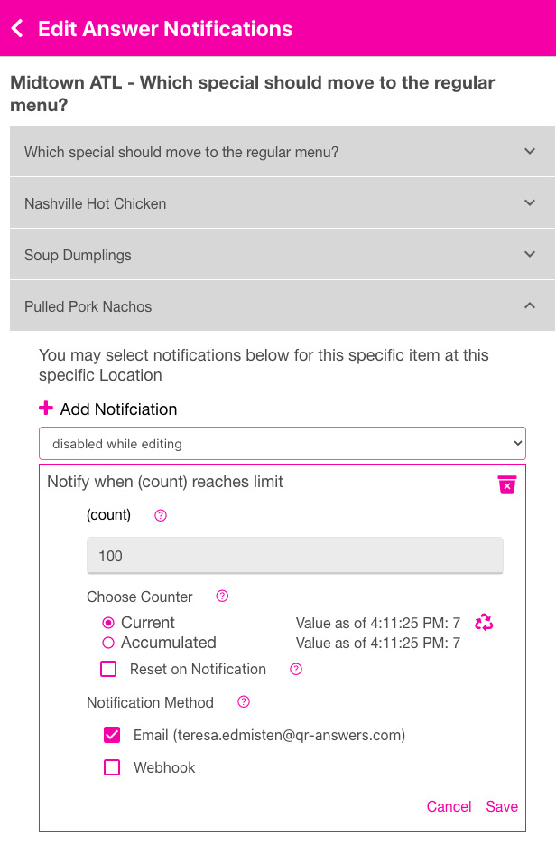

<i class="fa-solid fa-arrow-up"></i>

# Limit
{: .no_toc }

<i class="fa-solid fa-arrow-up"></i>

  

    Quick Links
  

  {: .text-delta }
- Quick Links
{: toc}

The LIMIT notification will be triggered once the Current or Accumulated counter reaches a number you choose.  For example, if you have a question *"Which special should move to the regular menu?"* and you want to be notified when 100 QR codes are scanned for the answer *"Pulled Pork Nachoes"*, then use the LIMIT notification rule and choose the Current counter.

  

   
   

The Current counter is a variable counter that you control by resetting it when you wish to zero (0).  The Accumulated counter is a running-total of the number of scans/votes that have been reigstered for this item.  When you first launch a Campaign, all counts (Current and Aggregated) are set to 0.  As QR codes Answers are scanned, those counts start to increase. If you want to automatically reset the Current counter to 0 when your LIMIT notification happens, check the "Reset on Notification" checkbox. You may not reset the Accumulated counter.

The values shown to the right of the Current and Accumulated radio buttons are the counts of those items when the form was loaded. To reset the Current count to 0, press the recycle button. You may select to be notified via email or webhook or both.  Be sure to press Save when you are done. You may delete the Notification by pressing the trash can icon <i class="fa-solid fa-trash">.
