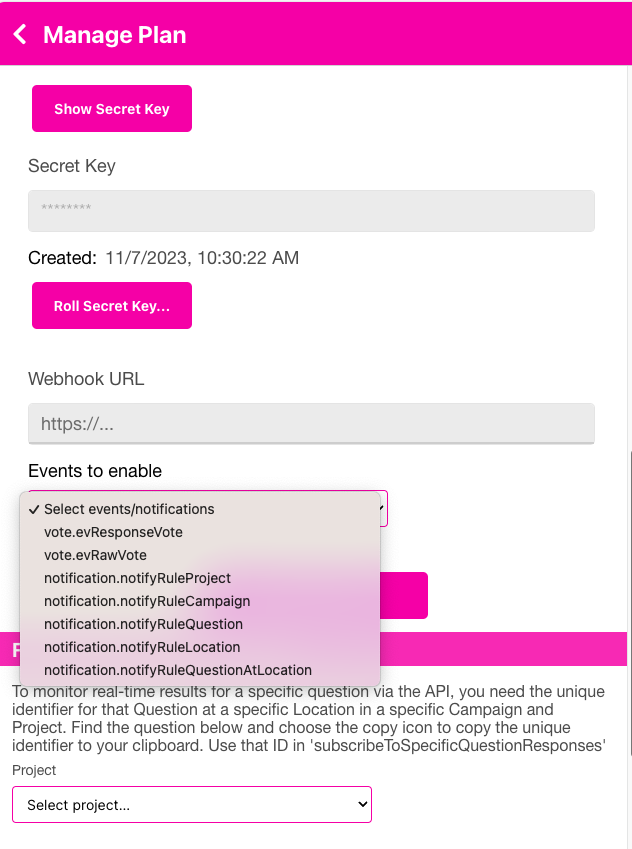

# Vote Notifications

QR-Answers supports notifications on particular events that may occur.  You may choose to be notified via Email or, if you are a developer, webhooks.  Your Team Administrator is responsible for giving you access to Projects under the [Manage Team](../menu/home_menu.html#team) section.  If you have access to a Project, you may add or remove Notifications for that Project.  If you are assigned a Developer role for the Project, you may also receive Notifications via the webhook as described [here](../developer/webhook.html).

There are Vote Notifications that occur when votes (someone scans an Answer QR code) are registered.  You may put Notifications at several different levels depending on your requirements.  You may setup Notifications at the Project, Campaign, Question, Location, Question Location (this is a specific question at a specific location) and Answers.  See the diagram below that shows how all of these are related.  The scanning of an Answer triggers an internal event that increments counters at each of those levels.  You set notifications based on those counters or timeframes that have passed.

{: .warning }
> Your Team Administrator or someone with access to the Manage Plan -> Developer section must enable these Notification events under the "Events to enable" dropdown.  If they are not enabled there, you will not receive them. So, there are 2 steps - enable them under the Manage Plan -> Developer accordion and then add the Notification at whichever level you desire.  The events to enable are: notification.notifyRuleProject (for Projects), notification.notifyRuleCampaign (for Campaigns), notification.notifyRuleQuestion (for Questions), notification.notifyRuleLocation (for Locations) or notification.notifyRuleQueationAtLocation (for Questions at a specific Location).

   

   
   

## Project Level
If you setup Notifications at the Project level, then the votes are aggregated across all Campaigns, Questions, Locations and Answers for that given Project.  So, if you setup a Notification to occur after every 1000 votes - you will receive the notification after the total # of scans of QR Answer codes across all Campaigns.  These would cover any Location, Question or Answer under this Project.

## Campaign Level
You may also setup Notifications at the Campaign level.  So, instead of votes being accumulated across all Campaigns in a Project, setting the Notification at the Campaign level will only look at the Answers scanned for the chosen Campaign.

## Location Level

You may set the Notification at the Location level as well.  The Location level notifications will occur when the count of scanned votes/answers for that Location (across all Campaigns in the given Project) reaches a particular level. 

## Question Level

Setting Notifications at the Question level allows you to track all Answers under a given Question across the entire Project.  So, if you setup a Question - "Who do you think will score next?" with the Answers  "49ers" or "Chiefs" and you post that Question on the scoreboard of 3 different Locations, then the Notification will occur after the counts are reached across all of those Locations in total.  So, if Levi's Stadium had 2000 votes for 49ers and 3000 votes for Chiefs; the State Farm Stadium had 2200 for the 49ers and 1500 for the Chiefs; and the Allegiant Stadium had 12,000 49ers and 13,000 Chiefs, you would end up with:
     2,000 (49ers)
     3,000 (chiefs)
     2,200 (49ers)
     1,500 (Chiefs)
    12,000 (49ers)
    13,000 (Chiefs)
    -------
    33,700 total

So, if you had a LIMIT Notification of 33,000 you would have gotten that when 700 fewer votes were received.  The Question level notifications are for the cumulative total of votes across all Answers.

If you put Notifications at the Answer level of the same Question, then you would receive Notifications when the trigger happens related to the Specific Answer.  For example, in the illustration above, if you had put a EVERY Notification on the Chief's Answer for a count of 4,000 - you would have gotten the Notification 4 times - once at 4,000, once at 8,000, once at 12,000 and once at 16,000 votes - basically Every 4,000 votes.

## QuestionLocation Level (Specific Question at a Specific Location)
The previous description is for a Question at *any* Location (or think about it as the Question answer no matter where it is). The QuestionLocation level (we also refere to this as Question Assignment Level or Specific Question at Specific location) Notification, which can be found by pressing the Notifications icon <> next to the Question in the Question Assignments and Printing area of a Campaign.  You click on the Location and to the right are the checkboxes that indicate whether that Question is used at that Location.  To the left is the Notifications icon <> which will bring up the Notifications form.  For a Question, you may put a notification on the Question (totalling all Answers) or Notifications at the Answer level (different Notifications for each Answer).  So, if you are speaking at a conference and you post a question of "Let me know if you are confused"; with two answers "Now" and "I'm good" on the overhead projector; you may have set an Answer level Notification on "Now" of 5, so when there are 5 people that scan that Answer, you will be notified.

## Current vs. Accumulated

There are 2 counters for LIMIT and EVERY Notification types.  Those are Current and Accumulated.  Think of Current as something you can reset anytime to 0 and Accumulated is a counter that just keeps on going - you can't reset it.  So, if you attached a LIMIT Notification to the Current counter and your limit is 2,000, then when the Current counter goes from 0 to 2,000 - you will be Notified.  You may reset the Current counter by checking the 'Reset on Notification' checkbox of the Notification form, or any time by using the link in the Notification email you receive, or by calling the [resetNotificationAggregate API](../developer/api.html#reset-current-counter).

## Example

Let's say we create a Project called "Football" and we use the "Who do you think will score next?" Question. We've posted it at 3 Locations. We've also created a Campaign called "Scoring in February" that includes those 3 Locations and our Question.  If someone at Allegiant Stadium is the 1st to scan an Answer of "Chiefs', then the following counters are affected.

 Project - "Football"
   -- Current count +1
   -- Accumulated count +1
 Campaign - "Scoring in February"
   -- Current count +1
   -- Accumulated count +1
 Question - "Who do you think will score next?"
   -- Current count +1
   -- Accumulated count +1
 Answer - "Chiefs" for "Who do you think will score next?" (all Locations)
   -- Current count +1
   -- Accumulated count +1
 Location - "Allegiant Stadium"
   -- Current count +1
   -- Accumulated count +1
 Question Location - "Who do you think will score next?" posted at Location "Allegiant Stadium"
   -- Current count +1
   -- Accumulated count +1
 Answer - "Chiefs" for "Who do you think will score next?" posted at Location "Allegiant Stadium"
   -- Current count +1
   -- Accumulated count +1
