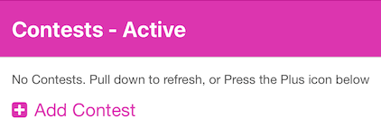
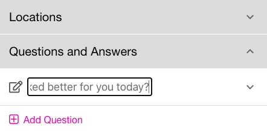
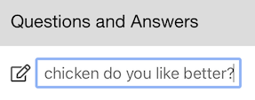
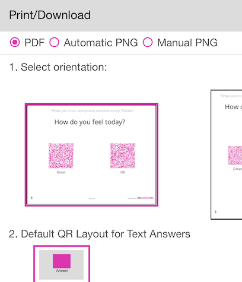
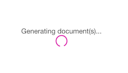
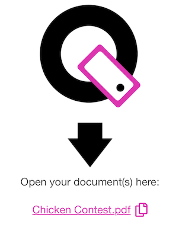

# First Contest
{: .no_toc }
This section will show you how to create your first Contest with a single Question and 3 Answers.
For QR-Contest, go to <a href="https://app.qr-contest.com" target="_blank">https://app.qr-contest.com</a> and log in.  If you have not created an account, go here [Creating an Account](../account)

---

1. Choose Contests in the bottom nav bar

   
2. Press the plus sign Add Contest

   
3. Enter the Contest name and press \<Enter\>

   
4. Click on the Contest name to add Question(s) and Answers here:

   
5. Click Add Question, enter the question, e.g. *Which chicken do you like better?*:

   

{: .note }
> Any time you have text in a list, you may long-press on it to edit the text inline.  This saves you steps from pressing the pencil and editing the text in a form.

6. Click Add Answer.  Enter some text answers (we'll add images later).

   
7. Scroll down and click the Print/Download section accordion.

   
8. You can make a PDF or individual PNG files; just scroll down and click Make PDF

   
9. Your PDF will be generated showing your Question and Answers.  

   
10. After it downloads, you can click on the name to print it or display it on your screen.

   
11. Now you can test your Contest Question by using your phone's camera and scan one of the QR code answers.  When the link appears, click it.  Done!  You're answer will be recorded and you will see the results.

