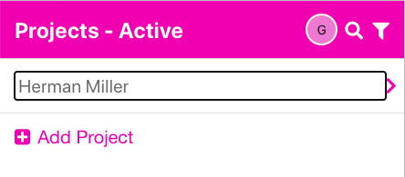
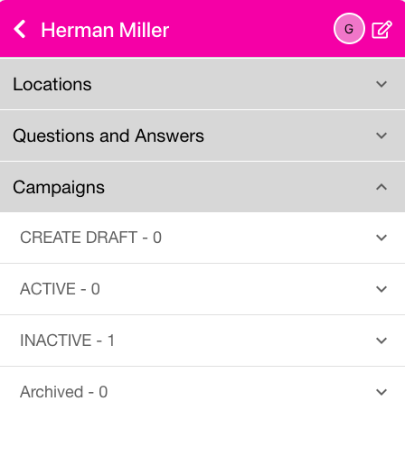
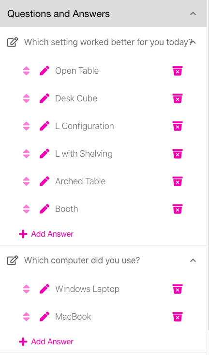

<i class="fa-solid fa-arrow-up"></i>

# First Project
{: .no_toc }
This section will show you how to create your first Project with a single Question and 6 Answers.
For QR-Answers, go to <a href="https://app.qr-answers.com" target="_blank">https://app.qr-answers.com</a> and log in.  If you have not created an account, go here [Creating an Account](../account) to learn how to sign up.  To understand the Project concept, read <a href="../../index/#project-concept---important">Project Concept</a>.

---

1

Choose Projects in the bottom nav bar

   

   
   

2

Press the plus sign <i class="fa-solid fa-square-plus"></i> Add Project

   

     
   

3

Enter the Project name and press &lt;Enter&gt;

   

     
   

4

Click on the Project name to add Location(s), Question(s), Answers and Campaigns.  By default, the screen opens the Campaigns accordion. You need to add a Location prior to adding Questions.  Locations can be buildings, room names, franchise locations, etc.  You may have the same Question at multiple Locations, so a Location scopes a Question to a place.

   

     
   

5

Click on the Locations accordion and then click plus sign <i class="fa-solid fa-square-plus"></i> Add and enter a Location name; in this case we entered Showroom B.

   

   
   

{: .new }
> Any time you have text in a list, you may long-press on it to edit the text inline.  This saves you steps from pressing the pencil and editing the text in a form.

Let's add a second location so we can assign Questions to different Locations.  Add a new Location called Lobby.

   

   
   

6

Now that we have a Location, we can add a Question.  Click on the Questions and Answers accordion  and press the plus sign <i class="fa-solid fa-square-plus"></i> Add Question button to enter a question - like <i>Which setting worked better for you today?</i>

   

   
   

The plus sign Add Answer option will show automatically after you enter your Question.

   

   
   

8

Now click the Add Answer button to add an Answer, then add the rest of the answers like below (the answers will make more sense when we add photos to them later):

   

   
   

   

   
   

9

Let's add another Question. Follow the procedure above so that you get this:

   

   
   

10

To use your Questions, you need to create a Campaign, open the Campaigns accordion and click on CREATE DRAFT.  Click the plus sign <i class="fa-solid fa-square-plus"></i> Add icon to add a new Campaign.  We entered <i>Furniture Use - ACME Corp</i>.  This Campaign has employees from ACME Corp go through a showroom and use different workstations to see which ones they liked better.

   

   
   

{: .note }
> Campaigns go through a cycle of DRAFT (to test your Locations and Questions), then ACTIVE (where someone can scan the code and regsiter their vote); then INACTIVE (when the Campaign is completed and the time for it has passed).

11

The next thing to do is to set up your Campaign's options.  Click on the Campaign name <i>Furniture Use - ACME Corp</i> to show the below screen:

The Campaign Question Assignments accordion is open by default.  There are many options for your Campaigns in the other accordions that will be covered under the Campaigns section.  For now, we will just assign our Question(s) to a Location so we may print our first draft.

12

The Campaign Question Assignments accordion shows a list of Locations that you created for this Project.  You may assign Question(s) to each Location separately.  Let's assign a Question to <strong>Showroom B</strong> and another Question to <strong>Lobby</strong>.  Skip the download icon on the left and click on the words <strong>Showroom B</strong> or the down arrow <i class="fa-solid fa-angle-down"></i> icon.  You will see a list of the available Questions for this Project. Check the box next to <i>Which Setting worked better for you today?</i>.  That will enable this Question at the Showroom B Location.  (Remember, you can assign that Question to multiple locations).

{: .new }
> Any time you check a box next to a question, the global 'clear all' checkbox at the top right of the list will be enabled. This is a shortcut for 'clear all checkboxes for all locations'.

Now, open the second location <strong>Lobby</strong> and check the <i>Which computer did you use?</i> for that Location.

13

Let's print a test for the <strong>Showroom B</strong> Location.  Click on the download <i class="fa-solid fa-download"></i> icon to the left of the Location name.  You will then see the below screen.  Note, you can print all of your questions by using the Campaign Bulk Print accordion - we'll do that later.

Just use the defaults for now, so click Make PDF.  You will get a progress screen saying "Generating documents...", then the below screen will appear with a link to your PDF file and a copy <i class="fa-solid fa-copy"></i>  icon in case you want to paste the link somewhere else.

Click on the link and you will see the PDF below.  You can test your choices by scanning them with your phone's camera.  Beware, you are only in DRAFT mode, so you will only see the last thing you scanned show up in the results.  Once you move the Campaign to ACTIVE, it will start recording votes properly.

If we use the phone and scan the "Desk Cube" answer (center choice in the top row), you will see the below on your phone. Click the link where it shows <i class="fa-solid fa-link"></i>qr-answers.com > and you will see the results.

These results then show up on the phone, if you scroll down, it will show you the answer you chose; in this case "Desk Cube".

To make your Campaign ACTIVE, go here.

To learn about other Campaign settings, go here.
