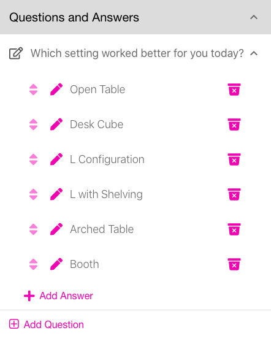

<i class="fa-solid fa-arrow-up"></i>

# Photo Answers
{: .no_toc }

---

Answers may have Text answers, Photo answers or a combination of both.  This will show you how to add Photos to your answers.

After completing the steps in [First Contest](firstcontest), you may add photos to your answers so the answers
have more visual appeal.

1

Go to your Project under the Projects bottom tab.

   

   
   

2

Click on the Project created in <a href="/docs/quickstart/firstcontest">First Project</a>. For this example, we used <i>Herman Miller</i>.  Then, click on the Questions and Answers accordion.

   

   
   

3

  

  For each answer shown there are 3 icons on the line. The up/down arrow <i class="fa-solid fa-up-down"></i> allows you to drag the order of the answers so they display in that order (long press on them to drag them).  The pencil icon <i class="fa-solid fa-pencil"></i> allows you to edit the details of the answer (there are many options).  The trash can icon on the far right <i class="fa-solid fa-trash"></i> allows you to delete that answer (it will ask you to confirm prior to actually deleting it.)
  

4

Let's add photos to each desk configuration.  Click the pencil icon next to <i>Open Table</i>. For details of all the options, see the <a href="../screens/edit_answer">Edit Answers</a> page. For now, we'll just add a photo.

   Click the <i class="fa-regular fa-square-check"></i> Photo checkbox. This will add an Image Preview section.  You may enter a URL, Upload a photo, or if you are on your phone - Take a Photo.  We'll upload a photo.

   

   
   

   {: .note }
   > After the photo is uploaded, you may rotate it by using the rotation buttons.  You will only be able to rotate it when you upload it, not after you save it by pressing Update.

   Scroll down and select the Update button to save your Photo.

5

Repeat the process for each Answer. You will end up with something like this:

   

   
   

6

Scroll down to the Campaigns accordion and click on it, then click on the CREATE DRAFT accordion, and then click on the "Furniture Use - ACME Corp" Campaign.  Click on the download <i class="fa-solid fa-download"></i> icon to the left of the "Showroom B" Location to get the DownloadDoc screen.  Then, scroll down to the Make PDF button.  Click the Make PDF button, then download and view your PDF.

  

Scan one of the QR-codes - then these results will show up on the phone, if you scroll down, it will show you the answer you chose; in this case "Desk Cube".

You may choose different layouts for the text, image and qr-codes for each answer in the DownloadDoc section, or you may output PNG files vs. a PDF.  See Campaigns for further information.
